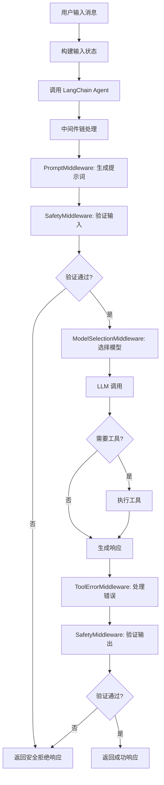
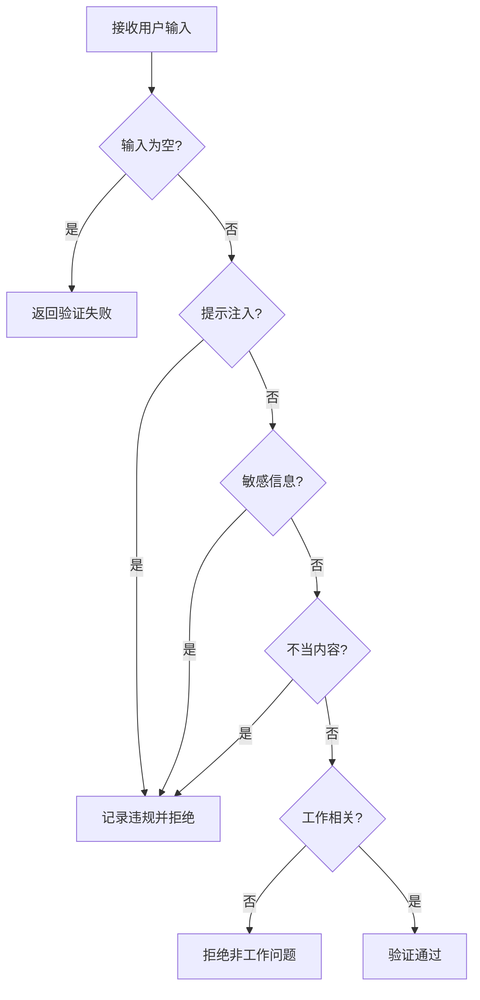
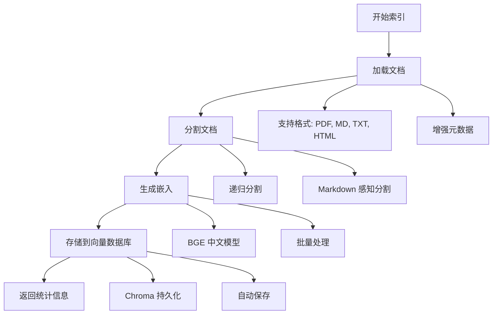
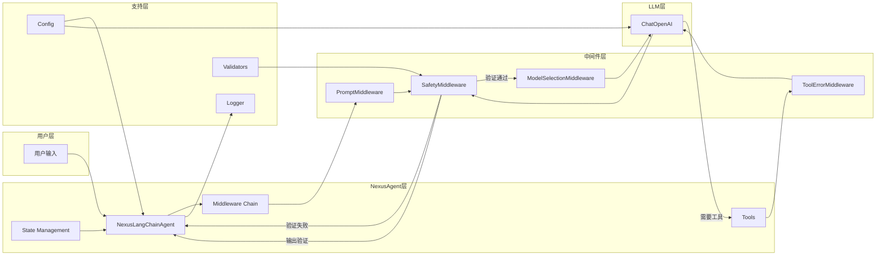
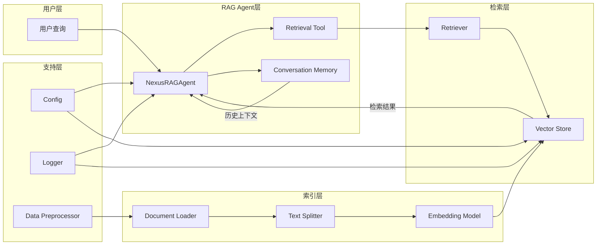

# 📚 Nexus Agent 项目学习指南

> 本文档详细介绍了 Nexus Agent 项目的架构、核心模块和代码实现，帮助你快速理解和学习项目代码。涵盖了 Sprint 1（原型开发）和 Sprint 2（RAG 基础）的完整实现。

---

## 目录

1. [项目概述](#1-项目概述)
2. [项目架构](#2-项目架构)
3. [核心模块详解 - Sprint 1](#3-核心模块详解---sprint-1)
4. [RAG 核心模块详解 - Sprint 2](#4-rag-核心模块详解---sprint-2)
5. [完整数据流图](#5-完整数据流图)
6. [使用示例](#6-使用示例)
7. [学习路径建议](#7-学习路径建议)
8. [关键设计模式](#8-关键设计模式)
9. [复杂概念详解](#9-复杂概念详解)
10. [扩展建议](#10-扩展建议)

---

## 1. 项目概述

### 1.1 项目简介

**Nexus Agent** 是一个基于 LangChain 1.0 的智能对话系统，专为帮助新员工快速适应工作环境而设计。项目采用模块化架构，结合了对话代理（Sprint 1）和检索增强生成（RAG，Sprint 2）能力。

**Sprint 1 核心功能：**
- 使用 LangChain 1.0 的 `create_agent` API 构建对话代理
- 中间件架构实现安全检查、动态模型选择和工具调用
- 多提供商 LLM 支持（OpenAI、DeepSeek、Qwen）
- 完善的安全验证和日志系统

**Sprint 2 核心功能：**
- 文档加载和索引（支持 PDF、Markdown、HTML、Text）
- BGE 中文优化嵌入模型
- Chroma 向量数据库集成
- 多种检索策略（相似度、MMR、混合检索）
- RAG 代理实现，支持基于知识库的问答

### 1.2 核心特性

| 特性 | 说明 | Sprint |
|------|------|--------|
| 🔒 安全可靠 | 内置输入/输出验证，防止提示注入和敏感信息泄露 | 1 |
| 🤖 多提供商支持 | 支持 OpenAI、DeepSeek、Qwen 等多种 LLM 提供商 | 1 |
| 💬 多轮对话 | 支持上下文感知的多轮对话 | 1, 2 |
| 🛠️ 工具调用 | 内置公司政策查询、联系方式获取等工具 | 1 |
| 📚 知识检索 | 从公司文档中检索相关信息，提供准确答案 | 2 |
| 🔍 语义搜索 | 使用向量嵌入进行语义相似度搜索 | 2 |
| 📊 监控追踪 | 完整的日志记录和 Token 使用追踪 | 1 |
| 🧪 测试完善 | 包含全面的安全测试和对话流程测试 | 1, 2 |
| 🔧 易于配置 | 通过环境变量灵活配置 | 1, 2 |
| ⚡ 中间件架构 | 使用 LangChain 1.0 中间件模式，模块化可扩展 | 1 |
| 🇨🇳 中文优化 | 使用 BGE 中文嵌入模型，优化中文语义理解 | 2 |

### 1.3 技术栈

**Sprint 1 - 对话代理：**
- **语言**: Python 3.12+
- **框架**: LangChain 1.0 (使用 `create_agent` API)
- **配置管理**: Pydantic Settings
- **日志**: Rich Logging
- **包管理**: UV (推荐) 或 pip

**Sprint 2 - RAG 系统：**
- **文档加载**: LangChain Document Loaders (PyPDFLoader, TextLoader, WebBaseLoader)
- **文本分割**: LangChain Text Splitters (RecursiveCharacterTextSplitter, MarkdownTextSplitter)
- **嵌入模型**: BAAI/bge-small-zh-v1.5 (中文优化)
- **向量数据库**: Chroma (本地持久化存储)
- **检索策略**: 相似度搜索、MMR、阈值过滤、混合检索
- **数据预处理**: 自定义文本清理和提取工具

---

## 2. 项目架构

### 2.1 整体架构图

```
┌─────────────────────────────────────────────────────────────────┐
│                    Nexus Agent 完整架构                      │
│                                                              │
│  ┌──────────────────────────────────────────────────────────┐  │
│  │          NexusLangChainAgent (对话控制器)            │  │
│  │   ┌──────────────┐  ┌──────────────┐  ┌─────────┐ │  │
│  │   │   Tools      │  │ Middleware   │  │  State  │ │  │
│  │   │  (工具调用)   │  │ (中间件链)    │  │ (状态)  │ │  │
│  │   └──────────────┘  └──────────────┘  └─────────┘ │  │
│  └──────────────────────────────────────────────────────────┘  │
│                                                              │
│  ┌──────────────────────────────────────────────────────────┐  │
│  │          NexusRAGAgent (RAG 控制器)            │  │
│  │   ┌──────────────┐  ┌──────────────┐  ┌─────────┐ │  │
│  │   │ Retrieval    │  │  Vector     │  │ Memory  │ │  │
│  │   │   Tool      │  │  Store      │  │ (记忆)  │ │  │
│  │   └──────────────┘  └──────────────┘  └─────────┘ │  │
│  └──────────────────────────────────────────────────────────┘  │
│                                                              │
│  ┌──────────────────────────────────────────────────────────┐  │
│  │              RAG 索引管道 (ETL)                     │  │
│  │   ┌──────┐  ┌────────┐  ┌──────────┐  ┌──────┐│  │
│  │   │Load  │→ │ Split  │→ │Embedding │→ │Store ││  │
│  │   │文档  │  │文本    │  │生成      │  │向量  ││  │
│  │   └──────┘  └────────┘  └──────────┘  └──────┘│  │
│  └──────────────────────────────────────────────────────────┘  │
│                                                              │
│  ┌──────────────────────────────────────────────────────────┐  │
│  │              支持层                                 │  │
│  │   ┌──────────┐  ┌────────┐  ┌──────────┐   │  │
│  │   │  Config  │  │ Logger │  │Validator │   │  │
│  │   │  配置管理 │  │ 日志   │  │ 验证器   │   │  │
│  │   └──────────┘  └────────┘  └──────────┘   │  │
│  └──────────────────────────────────────────────────────────┘  │
└─────────────────────────────────────────────────────────────────┘
```

### 2.2 RAG 架构图

```
┌─────────────────────────────────────────────────────────────┐
│                    RAG 系统架构                         │
│                                                           │
│  用户查询                                                  │
│     ↓                                                     │
│  ┌─────────────────────────────────────────────────┐         │
│  │  NexusRAGAgent (RAG 代理)                  │         │
│  │  - 接收用户查询                                │         │
│  │  - 决定是否需要检索                             │         │
│  │  - 调用检索工具                                │         │
│  └─────────────────────────────────────────────────┘         │
│     ↓                                                     │
│  ┌─────────────────────────────────────────────────┐         │
│  │  Retrieval Tool (检索工具)                │         │
│  │  - 向量化查询                                  │         │
│  │  - 搜索向量数据库                              │         │
│  │  - 返回相关文档                                │         │
│  └─────────────────────────────────────────────────┘         │
│     ↓                                                     │
│  ┌─────────────────────────────────────────────────┐         │
│  │  NexusVectorStore (向量存储)               │         │
│  │  - Chroma 向量数据库                           │         │
│  │  - 相似度搜索                                  │         │
│  │  - MMR 搜索                                   │         │
│  │  - 元数据过滤                                  │         │
│  └─────────────────────────────────────────────────┘         │
│     ↑                                                     │
│  ┌─────────────────────────────────────────────────┐         │
│  │  Document Indexing Pipeline (文档索引)       │         │
│  │                                                   │         │
│  │  ┌──────────┐  ┌──────────┐  ┌──────────┐│         │
│  │  │Document  │→ │   Text   │→ │Embedding ││         │
│  │  │  Loader  │  │ Splitter │  │  Model   ││         │
│  │  └──────────┘  └──────────┘  └──────────┘│         │
│  │       ↓              ↓              ↓           │         │
│  │  ┌──────────────────────────────────────┐│         │
│  │  │     NexusEmbeddings             ││         │
│  │  │  - BGE 中文模型                ││         │
│  │  │  - 句子嵌入生成                ││         │
│  │  │  - 余弦相似度计算              ││         │
│  │  └──────────────────────────────────────┘│         │
│  └─────────────────────────────────────────────────┘         │
│                                                           │
│  检索到的文档 + 用户查询                                 │
│     ↓                                                     │
│  LLM 生成回答（基于检索到的上下文）                         │
│     ↓                                                     │
│  用户响应                                                  │
└─────────────────────────────────────────────────────────────┘
```

### 2.3 目录结构

```
nexus-agent/
├── nexus_agent/
│   ├── agent/                  # 核心 Agent 模块
│   │   ├── agent.py           # 主 Agent 实现（Sprint 1）
│   │   ├── middleware.py      # 中间件实现（Sprint 1）
│   │   ├── state.py          # 状态管理（Sprint 1）
│   │   ├── tools.py          # 工具定义（Sprint 1）
│   │   ├── prompts.py        # 系统提示词（Sprint 1）
│   │   ├── rag_agent.py       # RAG Agent 实现（Sprint 2）
│   │   ├── retrievers.py      # 检索器配置（Sprint 2）
│   │   └── __init__.py
│   ├── rag/                    # RAG 核心模块（Sprint 2）
│   │   ├── document_loader.py # 文档加载器
│   │   ├── text_splitter.py   # 文本分割器
│   │   ├── embeddings.py      # 嵌入模型
│   │   ├── vector_store.py    # 向量存储管理
│   │   ├── indexing.py       # 文档索引管道
│   │   ├── retrieval.py      # 检索逻辑
│   │   └── __init__.py
│   ├── config/                 # 配置管理
│   │   ├── settings.py        # 配置类（包含 RAG 配置）
│   │   └── __init__.py
│   ├── data/                   # 数据目录
│   │   ├── documents/        # 原始文档
│   │   │   ├── employee_handbook.md
│   │   │   └── it_support.md
│   │   ├── processed/        # 处理后的数据
│   │   └── chroma_db/       # Chroma 向量数据库
│   ├── tests/                  # 测试套件
│   │   ├── test_prompts.py           # 提示词安全测试
│   │   ├── test_conversation.py      # 对话流程测试
│   │   ├── test_rag.py              # RAG 单元测试
│   │   ├── test_rag_integration.py   # RAG 集成测试
│   │   └── __init__.py
│   ├── utils/                  # 工具模块
│   │   ├── logger.py         # 日志工具
│   │   ├── validators.py     # 输入/输出验证
│   │   ├── data_preprocessing.py  # 数据预处理（Sprint 2）
│   │   └── __init__.py
│   └── __init__.py
├── plans/                      # 项目规划文档
│   ├── sprint1-prototype-plan.md      # Sprint 1 计划
│   ├── sprint2-rag-basics-plan.md    # Sprint 2 计划
│   └── langchain-1.0-syntax-guide.md # LangChain 1.0 语法指南
├── demo_script.py              # Sprint 1 演示脚本
├── demo_rag.py                # Sprint 2 RAG 演示脚本
├── demo_document_processing.py  # Sprint 2 文档处理演示
├── main.py                     # 主入口
├── pyproject.toml              # 项目配置
├── .env.example               # 环境变量示例
├── README.md                  # 项目文档
└── PROJECT_GUIDE.md           # 本学习指南
```

---

## 3. 核心模块详解 - Sprint 1

### 3.1 nexus_agent/agent/agent.py - 核心控制器

#### 主要类

##### NexusLangChainAgent
主 Agent 类，使用 LangChain 1.0 的 `create_agent` API 构建。

**初始化参数:**
```python
def __init__(self,
             provider: str = None,              # LLM 提供商
             model: str = None,                 # 模型名称
             temperature: float = None,         # 响应随机性
             enable_safety_checks: bool = True) # 启用安全检查
```

**核心方法:**

| 方法 | 说明 | 文件位置 |
|------|------|----------|
| [`process_message()`](nexus_agent/agent/agent.py:223) | 处理用户消息 | agent.py:223 |
| [`stream_message()`](nexus_agent/agent/agent.py:311) | 流式响应 | agent.py:311 |
| [`chat()`](nexus_agent/agent/agent.py:362) | 简化对话接口 | agent.py:362 |
| [`interactive_chat()`](nexus_agent/agent/agent.py:367) | 启动交互式对话 | agent.py:367 |
| [`get_agent_info()`](nexus_agent/agent/agent.py:412) | 获取 Agent 信息 | agent.py:412 |
| [`test_connection()`](nexus_agent/agent/agent.py:424) | 测试连接 | agent.py:424 |

##### AgentResponse
响应数据类，包含所有响应信息。

```python
@dataclass
class AgentResponse:
    content: str                      # 响应内容
    success: bool                     # 是否成功
    error: Optional[str] = None        # 错误信息
    tokens_used: Optional[Dict] = None # Token 使用统计
    duration: Optional[float] = None  # 响应时间
    context_id: Optional[str] = None  # 对话 ID
    metadata: Optional[Dict] = None   # 额外元数据
    tool_calls: Optional[List[Dict]] = None  # 工具调用记录
```

#### 消息处理流程图



---

### 3.2 nexus_agent/agent/middleware.py - 中间件实现

#### 主要类

##### SafetyMiddleware
安全验证中间件，在模型调用前后进行输入/输出验证。

**核心方法:**

| 方法 | 说明 | 文件位置 |
|------|------|----------|
| [`before_model()`](nexus_agent/agent/middleware.py:480) | 模型调用前验证输入 | middleware.py:480 |

**验证项:**

| 类别 | 检测内容 | 示例模式 |
|------|----------|----------|
| 提示注入 | ignore/forget/disregard 指令 | `(?i)(ignore\|forget).*previous.*instruction` |
| 敏感信息 | salary/password/personal data | `(?i)(salary\|password).*information` |
| 不当内容 | hack/crack/illegal | `(?i)(hack\|crack).*system` |
| 工作相关性 | 是否包含工作关键词 | work, job, company, 工作, 公司 |

##### NexusModelSelectionMiddleware
动态模型选择中间件，根据对话复杂度选择合适的模型。

**核心方法:**

| 方法 | 说明 | 文件位置 |
|------|------|----------|
| [`select_model()`](nexus_agent/agent/middleware.py:544) | 选择合适的模型 | middleware.py:544 |

**选择策略:**
- 短对话（< 10 条消息）：使用轻量级模型（如 gpt-4o-mini）
- 长对话（≥ 10 条消息）：使用高级模型（如 gpt-4o）

##### NexusPromptMiddleware
动态提示词生成中间件，根据用户角色定制系统提示词。

**核心方法:**

| 方法 | 说明 | 文件位置 |
|------|------|----------|
| [`generate_prompt()`](nexus_agent/agent/middleware.py:619) | 生成动态系统提示词 | middleware.py:619 |

**定制选项:**
- 新员工：提供更详细和耐心的解释
- 管理者：提供更简洁和专业的回答

##### ToolErrorMiddleware
工具错误处理中间件，捕获工具执行错误并返回友好消息。

**核心方法:**

| 方法 | 说明 | 文件位置 |
|------|------|----------|
| [`handle_tool_errors()`](nexus_agent/agent/middleware.py:644) | 处理工具执行错误 | middleware.py:644 |

---

### 3.3 nexus_agent/agent/state.py - 状态管理

#### 主要类

##### NexusAgentState
扩展的 Agent 状态类，继承自 LangChain 的 `AgentState`。

```python
class NexusAgentState(AgentState):
    """Extended state for Nexus Agent"""
    user_id: Optional[str] = None           # 用户 ID
    session_id: Optional[str] = None        # 会话 ID
    user_preferences: Dict[str, Any] = {}   # 用户偏好
    conversation_stats: Dict[str, int] = {} # 对话统计
```

---

### 3.4 nexus_agent/agent/tools.py - 工具定义

#### 可用工具

| 工具名称 | 说明 | 参数 |
|---------|------|------|
| [`lookup_company_policy()`](nexus_agent/agent/tools.py:775) | 查询公司政策 | topic (政策主题) |
| [`get_contact_info()`](nexus_agent/agent/tools.py:804) | 获取部门联系方式 | department (部门名称) |
| [`search_knowledge_base()`](nexus_agent/agent/tools.py:830) | 搜索知识库 | query (搜索查询) |
| [`get_onboarding_guide()`](nexus_agent/agent/tools.py:868) | 获取入职指南 | step (可选步骤) |

#### 工具实现示例

```python
@tool
def lookup_company_policy(topic: str) -> str:
    """Look up company policies and procedures.
    
    Args:
        topic: The policy topic to search for (e.g., 'expense', 'leave', 'onboarding')
    
    Returns:
        Information about requested policy topic
    """
    policies = {
        "expense": "公司报销政策：员工需要提交费用报销单，附上相关发票...",
        "leave": "请假政策：员工需提前通过HR系统提交请假申请...",
        "onboarding": "新员工入职流程：1. 完成入职表格 2. 领取设备...",
        # ... 更多政策
    }
    
    for key in policies:
        if key in topic.lower():
            return policies[key]
    
    return policies["default"]
```

---

### 3.5 nexus_agent/agent/prompts.py - 提示词管理

#### 提示词类型

##### BASE_SYSTEM_PROMPT
基础系统提示词，定义助手的角色和能力。

**包含内容:**
- 角色定位
- 核心能力
- 交互原则
- 安全边界
- 可用工具列表

##### get_system_prompt()
根据用户角色定制系统提示词。

**参数:**
- `user_role`: 用户角色（如 "new_employee", "manager"）

**定制示例:**
```python
def get_system_prompt(user_role: str = "new_employee") -> str:
    prompt = BASE_SYSTEM_PROMPT
    
    if user_role == "new_employee":
        prompt += "\n\n## 特别说明\n用户是新员工，请提供更详细和耐心的解释..."
    elif user_role == "manager":
        prompt += "\n\n## 特别说明\n用户是管理者，请提供更简洁和专业的回答..."
    
    return prompt
```

---

### 3.6 nexus_agent/utils/validators.py - 安全验证器

#### 主要类

##### InputValidator
输入验证器，检测潜在的安全威胁。

**验证项:**

| 类别 | 检测内容 | 示例模式 |
|------|----------|----------|
| 提示注入 | ignore/forget/disregard 指令 | `(?i)(ignore\|forget).*previous.*instruction` |
| 敏感信息 | salary/password/personal data | `(?i)(salary\|password).*information` |
| 不当内容 | hack/crack/illegal | `(?i)(hack\|crack).*system` |
| 工作相关性 | 是否包含工作关键词 | work, job, company, 工作, 公司 |

##### OutputValidator
输出验证器，确保响应内容安全适当。

**验证项:**

| 类别 | 检测内容 | 示例模式 |
|------|----------|----------|
| 角色保持 | 是否保持助手身份 | `(?i)(i am\|我是).*(not\|不是).*nexus` |
| 禁止内容 | 是否包含敏感信息 | `(?i)(here's\|这是).*(password\|secret)` |
| 适当性 | 回复是否得体 | 检查礼貌用语 |

##### MessageHandler
消息处理器，结合输入和输出验证。

**核心方法:**

| 方法 | 说明 | 文件位置 |
|------|------|----------|
| [`validate_input()`](nexus_agent/utils/validators.py:1098) | 验证输入 | validators.py:1098 |
| [`validate_output()`](nexus_agent/utils/validators.py:1106) | 验证输出 | validators.py:1106 |
| [`get_validation_details()`](nexus_agent/utils/validators.py:492) | 获取详细验证结果 | validators.py:492 |

##### ValidationResult
验证结果数据类。

```python
@dataclass
class ValidationResult:
    is_valid: bool    # 是否有效
    reason: str       # 原因说明
    action: str       # 操作类型: allow/block/modify
```

#### 输入验证流程图



---

### 3.7 nexus_agent/utils/logger.py - 日志系统

#### 主要类

##### NexusLogger
结构化日志记录器。

**日志方法:**

| 方法 | 说明 | 文件位置 |
|------|------|----------|
| [`log_conversation()`](nexus_agent/utils/logger.py:1181) | 记录对话 | logger.py:1181 |
| [`log_error()`](nexus_agent/utils/logger.py:1192) | 记录错误 | logger.py:1192 |
| [`log_llm_call()`](nexus_agent/utils/logger.py:1203) | 记录 LLM 调用 | logger.py:1203 |
| [`log_safety_violation()`](nexus_agent/utils/logger.py:1215) | 记录安全违规 | logger.py:1215 |
| [`log_system_event()`](nexus_agent/utils/logger.py:1226) | 记录系统事件 | logger.py:1226 |

**日志格式示例:**

```json
{
  "timestamp": "2024-01-01T12:00:00.000Z",
  "event_type": "conversation",
  "user_input": "你好，我是新员工",
  "agent_response": "欢迎加入公司！...",
  "metadata": {
    "context_id": "user1_session1",
    "duration": 1.23,
    "tool_calls_count": 2
  }
}
```

---

### 3.8 nexus_agent/config/settings.py - 配置管理

#### 主要类

##### NexusConfig
使用 Pydantic 的配置类。

**配置项:**

| 配置项 | 类型 | 默认值 | 说明 |
|--------|------|--------|------|
| `llm_provider` | Literal | "openai" | LLM 提供商 |
| `llm_model` | str | "gpt-4o" | 模型名称 |
| `temperature` | float | 0.7 | 响应随机性 (0.0-2.0) |
| `openai_api_key` | Optional[str] | None | OpenAI API 密钥 |
| `deepseek_api_key` | Optional[str] | None | DeepSeek API 密钥 |
| `qwen_api_key` | Optional[str] | None | Qwen API 密钥 |
| `log_level` | Literal | "INFO" | 日志级别 |
| `log_file` | Optional[str] | None | 日志文件路径 |
| `max_conversation_length` | int | 10 | 最大对话长度 |
| `enable_safety_checks` | bool | True | 启用安全检查 |
| `max_retries` | int | 3 | 最大重试次数 |
| `retry_delay` | float | 1.0 | 重试延迟（秒） |
| `max_tokens` | int | 1000 | 最大 Token 数 |

**Sprint 2 新增配置项:**

| 配置项 | 类型 | 默认值 | 说明 |
|--------|------|--------|------|
| `data_directory` | str | "nexus_agent/data/documents" | 文档目录 |
| `chunk_size` | int | 1000 | 文本块大小 |
| `chunk_overlap` | int | 200 | 文本块重叠 |
| `text_splitter_strategy` | Literal | "recursive" | 分割策略 |
| `embedding_model` | str | "BAAI/bge-small-zh-v1.5" | 嵌入模型 |
| `embedding_device` | Literal | "cpu" | 嵌入设备 |
| `normalize_embeddings` | bool | True | 是否归一化嵌入 |
| `vector_store_type` | Literal | "chroma" | 向量存储类型 |
| `chroma_collection` | str | "nexus_knowledge_base" | Chroma 集合名称 |
| `chroma_persist_dir` | Optional[str] | "nexus_agent/data/chroma_db" | Chroma 持久化目录 |
| `retrieval_k` | int | 3 | 检索文档数 |
| `retrieval_score_threshold` | float | 0.7 | 相似度阈值 |
| `retrieval_search_type` | Literal | "similarity" | 检索类型 |

---

## 4. RAG 核心模块详解 - Sprint 2

### 4.1 nexus_agent/rag/document_loader.py - 文档加载器

#### 主要类

##### NexusDocumentLoader
多格式文档加载器，支持 PDF、Markdown、Text、HTML 文件。

**初始化参数:**
```python
def __init__(self, data_dir: str = "nexus_agent/data/documents")
    """
    Args:
        data_dir: 包含文档的目录路径
    """
```

**核心方法:**

| 方法 | 说明 | 文件位置 |
|------|------|----------|
| [`load_documents()`](nexus_agent/rag/document_loader.py:161) | 加载文档 | document_loader.py:161 |
| [`get_document_stats()`](nexus_agent/rag/document_loader.py:295) | 获取文档统计 | document_loader.py:295 |

**支持的文件格式:**

| 格式 | 扩展名 | 加载器 | 说明 |
|------|---------|--------|------|
| PDF | .pdf | PyPDFLoader | 每页一个文档 |
| Markdown | .md, .markdown | TextLoader | UTF-8 编码 |
| Text | .txt | TextLoader | UTF-8 编码 |
| HTML | .html, .htm | WebBaseLoader | 解析 HTML 内容 |

**元数据增强:**
每个加载的文档都会自动添加以下元数据：
- `source`: 文件路径
- `file_type`: 文件类型
- `file_name`: 文件名
- `file_size`: 文件大小（字节）
- `relative_path`: 相对路径

**使用示例:**
```python
from nexus_agent.rag.document_loader import NexusDocumentLoader

# 初始化加载器
loader = NexusDocumentLoader(data_dir="nexus_agent/data/documents")

# 加载所有文档
docs = loader.load_documents()

# 获取统计信息
stats = loader.get_document_stats(docs)
print(f"加载了 {stats['total_documents']} 个文档")
print(f"总字符数: {stats['total_characters']:,}")
print(f"文件类型: {stats['file_types']}")
```

---

### 4.2 nexus_agent/rag/text_splitter.py - 文本分割器

#### 主要类

##### NexusTextSplitter
高级文本分割器，支持递归分割和 Markdown 感知分割。

**初始化参数:**
```python
def __init__(
    self,
    chunk_size: int = 1000,        # 最大块大小（字符）
    chunk_overlap: int = 200,       # 块重叠（字符）
    strategy: Literal["recursive", "markdown"] = "recursive",  # 分割策略
    add_start_index: bool = True,   # 添加起始索引
)
```

**核心方法:**

| 方法 | 说明 | 文件位置 |
|------|------|----------|
| [`split_documents()`](nexus_agent/rag/text_splitter.py:419) | 分割文档 | text_splitter.py:419 |
| [`split_text()`](nexus_agent/rag/text_splitter.py:463) | 分割文本 | text_splitter.py:463 |
| [`get_split_stats()`](nexus_agent/rag/text_splitter.py:475) | 获取分割统计 | text_splitter.py:475 |
| [`create_custom_splitter()`](nexus_agent/rag/text_splitter.py:521) | 创建自定义分割器 | text_splitter.py:521 |

**分割策略:**

| 策略 | 说明 | 适用场景 |
|------|------|----------|
| recursive | 递归字符分割，按分隔符优先级分割 | 通用文本，保持语义完整性 |
| markdown | Markdown 感知分割，按标题、代码块等分割 | Markdown 文档，保持结构 |

**递归分割分隔符优先级:**
```python
separators = [
    "\n\n\n",  # 多个换行（段落）
    "\n\n",    # 双换行
    "\n",      # 单换行
    " ",       # 空格
    "",        # 字符级别
]
```

**使用示例:**
```python
from nexus_agent.rag.text_splitter import NexusTextSplitter
from nexus_agent.rag.document_loader import NexusDocumentLoader

# 加载文档
loader = NexusDocumentLoader()
docs = loader.load_documents()

# 创建分割器
splitter = NexusTextSplitter(
    chunk_size=1000,
    chunk_overlap=200,
    strategy="recursive"
)

# 分割文档
splits = splitter.split_documents(docs)

# 获取统计信息
stats = splitter.get_split_stats(docs)
print(f"创建了 {stats['total_chunks']} 个文本块")
print(f"平均块大小: {stats['average_chunk_size']:.0f} 字符")
print(f"块大小范围: {stats['chunk_size_range']}")
```

---

### 4.3 nexus_agent/rag/embeddings.py - 嵌入模型

#### 主要类

##### NexusEmbeddings
BGE（BAAI）中文嵌入模型包装器，优化中文文本理解。

**初始化参数:**
```python
def __init__(
    self,
    model_name: str = "BAAI/bge-small-zh-v1.5",  # BGE 模型名称
    device: str = "cpu",                     # 设备（cpu/cuda）
    normalize_embeddings: bool = True,          # 是否归一化嵌入
    encode_kwargs: Optional[dict] = None,      # 编码参数
)
```

**核心方法:**

| 方法 | 说明 | 文件位置 |
|------|------|----------|
| [`get_embeddings_model()`](nexus_agent/rag/embeddings.py:656) | 获取 LangChain 兼容的嵌入模型 | embeddings.py:656 |
| [`embed_query()`](nexus_agent/rag/embeddings.py:669) | 嵌入单个查询 | embeddings.py:669 |
| [`embed_documents()`](nexus_agent/rag/embeddings.py:682) | 嵌入多个文档 | embeddings.py:682 |
| [`get_embedding_dimension()`](nexus_agent/rag/embeddings.py:695) | 获取嵌入维度 | embeddings.py:695 |
| [`compute_similarity()`](nexus_agent/rag/embeddings.py:705) | 计算余弦相似度 | embeddings.py:705 |
| [`batch_embed()`](nexus_agent/rag/embeddings.py:735) | 批量嵌入 | embeddings.py:735 |

**BGE 模型特点:**
- **中文优化**: 专门针对中文文本训练，语义理解更准确
- **轻量级**: bge-small-zh-v1.5 模型较小，推理速度快
- **归一化支持**: 支持嵌入向量归一化，提高相似度计算准确性
- **SentenceTransformers**: 基于 SentenceTransformers 框架

**余弦相似度计算:**
```python
def compute_similarity(embedding1, embedding2):
    """计算两个嵌入向量的余弦相似度"""
    vec1 = np.array(embedding1)
    vec2 = np.array(embedding2)
    
    # 点积
    dot_product = np.dot(vec1, vec2)
    
    # 欧几里得范数
    norm1 = np.linalg.norm(vec1)
    norm2 = np.linalg.norm(vec2)
    
    # 余弦相似度
    if norm1 == 0 or norm2 == 0:
        return 0.0
    
    return dot_product / (norm1 * norm2)
```

**使用示例:**
```python
from nexus_agent.rag.embeddings import NexusEmbeddings

# 初始化嵌入模型
embeddings = NexusEmbeddings(
    model_name="BAAI/bge-small-zh-v1.5",
    device="cpu",
    normalize_embeddings=True
)

# 嵌入单个查询
query_embedding = embeddings.embed_query("公司的远程办公政策是什么？")
print(f"嵌入维度: {len(query_embedding)}")

# 嵌入多个文档
docs = ["公司政策", "IT支持", "员工福利"]
doc_embeddings = embeddings.embed_documents(docs)

# 计算相似度
similarity = embeddings.compute_similarity(query_embedding, doc_embeddings[0])
print(f"相似度: {similarity:.4f}")
```

##### EmbeddingCache
嵌入缓存，避免重复计算。

**核心方法:**

| 方法 | 说明 | 文件位置 |
|------|------|----------|
| [`get()`](nexus_agent/rag/embeddings.py:785) | 获取缓存的嵌入 | embeddings.py:785 |
| [`set()`](nexus_agent/rag/embeddings.py:802) | 缓存嵌入 | embeddings.py:802 |
| [`clear()`](nexus_agent/rag/embeddings.py:818) | 清空缓存 | embeddings.py:818 |
| [`get_stats()`](nexus_agent/rag/embeddings.py:825) | 获取缓存统计 | embeddings.py:825 |

---

### 4.4 nexus_agent/rag/vector_store.py - 向量存储

#### 主要类

##### NexusVectorStore
Chroma 向量存储管理器，支持持久化存储和多种检索策略。

**初始化参数:**
```python
def __init__(
    self,
    embeddings,                              # NexusEmbeddings 实例
    collection_name: str = "nexus_knowledge_base",  # 集合名称
    persist_directory: Optional[str] = None,          # 持久化目录（None 为内存模式）
)
```

**核心方法:**

| 方法 | 说明 | 文件位置 |
|------|------|----------|
| [`add_documents()`](nexus_agent/rag/vector_store.py:924) | 添加文档到向量存储 | vector_store.py:924 |
| [`similarity_search()`](nexus_agent/rag/vector_store.py:949) | 相似度搜索 | vector_store.py:949 |
| [`similarity_search_with_score()`](nexus_agent/rag/vector_store.py:981) | 带分数的相似度搜索 | vector_store.py:981 |
| [`similarity_search_by_vector()`](nexus_agent/rag/vector_store.py:1012) | 按向量搜索 | vector_store.py:1012 |
| [`max_marginal_relevance_search()`](nexus_agent/rag/vector_store.py:1046) | MMR 搜索 | vector_store.py:1046 |
| [`as_retriever()`](nexus_agent/rag/vector_store.py:1090) | 获取检索器接口 | vector_store.py:1090 |
| [`delete()`](nexus_agent/rag/vector_store.py:1104) | 删除文档 | vector_store.py:1104 |
| [`get_collection_stats()`](nexus_agent/rag/vector_store.py:1125) | 获取集合统计 | vector_store.py:1125 |
| [`clear_collection()`](nexus_agent/rag/vector_store.py:1152) | 清空集合 | vector_store.py:1152 |

**检索策略:**

| 策略 | 说明 | 适用场景 |
|------|------|----------|
| similarity | 标准相似度搜索，返回最相似的文档 | 通用场景，追求相关性 |
| mmr | 最大边际相关性，平衡相关性和多样性 | 避免重复，获取多样化结果 |
| similarity_score_threshold | 相似度阈值过滤，只返回超过阈值的文档 | 确保结果质量 |

**MMR（最大边际相关性）参数:**
- `k`: 返回的文档数量
- `fetch_k`: 候选文档数量（通常 > k）
- `lambda_mult`: 平衡参数
  - 1.0: 只考虑相关性
  - 0.5: 平衡相关性和多样性
  - 0.0: 只考虑多样性

**使用示例:**
```python
from nexus_agent.rag.vector_store import NexusVectorStore
from nexus_agent.rag.embeddings import NexusEmbeddings

# 初始化
embeddings = NexusEmbeddings()
vector_store = NexusVectorStore(
    embeddings=embeddings,
    collection_name="nexus_knowledge_base",
    persist_directory="nexus_agent/data/chroma_db"
)

# 添加文档
from langchain_core.documents import Document
docs = [
    Document(page_content="公司远程办公政策...", metadata={"source": "policy.md"}),
    Document(page_content="IT支持VPN配置...", metadata={"source": "it.md"}),
]
vector_store.add_documents(docs)

# 相似度搜索
results = vector_store.similarity_search("远程办公", k=3)

# 带分数的搜索
results_with_scores = vector_store.similarity_search_with_score("远程办公", k=3)
for doc, score in results_with_scores:
    print(f"分数: {score:.4f}")
    print(f"内容: {doc.page_content[:100]}...")

# MMR 搜索
mmr_results = vector_store.max_marginal_relevance_search(
    "远程办公",
    k=3,
    fetch_k=10,
    lambda_mult=0.5
)

# 元数据过滤
filtered_results = vector_store.similarity_search(
    "政策",
    k=5,
    filter={"source": "policy.md"}
)
```

---

### 4.5 nexus_agent/rag/indexing.py - 文档索引管道

#### 主要类

##### NexusIndexingPipeline
完整的 ETL（Extract-Transform-Load）管道，用于文档索引。

**初始化参数:**
```python
def __init__(
    self,
    data_dir: str = "nexus_agent/data/documents",      # 文档目录
    chunk_size: int = 1000,                         # 文本块大小
    chunk_overlap: int = 200,                        # 文本块重叠
    embedding_model: str = "BAAI/bge-small-zh-v1.5",  # 嵌入模型
    embedding_device: str = "cpu",                     # 嵌入设备
    persist_directory: Optional[str] = "nexus_agent/data/chroma_db",  # 持久化目录
    collection_name: str = "nexus_knowledge_base",    # 集合名称
)
```

**核心方法:**

| 方法 | 说明 | 文件位置 |
|------|------|----------|
| [`index_documents()`](nexus_agent/rag/indexing.py:1269) | 运行完整索引管道 | indexing.py:1269 |
| [`reindex_all()`](nexus_agent/rag/indexing.py:1377) | 重新索引所有文档 | indexing.py:1377 |
| [`update_documents()`](nexus_agent/rag/indexing.py:1400) | 更新指定文档 | indexing.py:1400 |
| [`test_retrieval()`](nexus_agent/rag/indexing.py:1434) | 测试检索功能 | indexing.py:1434 |
| [`get_pipeline_status()`](nexus_agent/rag/indexing.py:1466) | 获取管道状态 | indexing.py:1466 |

**索引管道流程:**



**使用示例:**
```python
from nexus_agent.rag.indexing import NexusIndexingPipeline

# 初始化管道
pipeline = NexusIndexingPipeline(
    data_dir="nexus_agent/data/documents",
    chunk_size=1000,
    chunk_overlap=200,
    embedding_model="BAAI/bge-small-zh-v1.5",
    persist_directory="nexus_agent/data/chroma_db"
)

# 索引文档
stats = pipeline.index_documents(verbose=True)
print(f"加载文档: {stats['loaded_documents']}")
print(f"创建块: {stats['total_chunks']}")
print(f"索引文档: {stats['indexed_documents']}")
print(f"处理时间: {stats['elapsed_time']:.2f} 秒")

# 测试检索
results = pipeline.test_retrieval("远程办公政策", k=3, verbose=True)

# 更新特定文档
pipeline.update_documents(
    file_paths=["nexus_agent/data/documents/employee_handbook.md"],
    verbose=True
)

# 重新索引所有
pipeline.reindex_all(verbose=True)
```

---

### 4.6 nexus_agent/rag/retrieval.py - 检索逻辑

#### 主要类

##### NexusRetriever
高级检索器，支持多种检索策略。

**初始化参数:**
```python
def __init__(
    self,
    vector_store,                          # NexusVectorStore 实例
    search_type: str = "similarity",       # 搜索类型
    search_kwargs: Optional[Dict] = None,   # 搜索参数
)
```

**核心方法:**

| 方法 | 说明 | 文件位置 |
|------|------|----------|
| [`_get_relevant_documents()`](nexus_agent/rag/retrieval.py:1547) | 检索相关文档 | retrieval.py:1547 |

**搜索类型:**
- `similarity`: 标准相似度搜索
- `mmr`: 最大边际相关性搜索
- `similarity_score_threshold`: 相似度阈值过滤

**搜索参数:**
- `k`: 返回文档数量
- `score_threshold`: 最小相似度分数（0-1）
- `fetch_k`: MMR 候选文档数量
- `lambda_mult`: MMR 平衡参数（0-1）
- `filter`: 元数据过滤条件

##### HybridRetriever
混合检索器，组合多个检索器的结果。

**初始化参数:**
```python
def __init__(
    self,
    retrievers: List[BaseRetriever],  # 检索器列表
    weights: Optional[List[float]] = None,  # 权重列表
    top_k: int = 5,                     # 返回结果数量
)
```

**核心方法:**

| 方法 | 说明 | 文件位置 |
|------|------|----------|
| [`get_relevant_documents()`](nexus_agent/rag/retrieval.py:1651) | 混合检索 | retrieval.py:1651 |
| [`add_retriever()`](nexus_agent/rag/retrieval.py:1691) | 添加检索器 | retrieval.py:1691 |

##### ContextualRetriever
上下文感知检索器，考虑查询历史。

**初始化参数:**
```python
def __init__(
    self,
    base_retriever: BaseRetriever,  # 基础检索器
    context_window: int = 3,            # 上下文窗口大小
)
```

**核心方法:**

| 方法 | 说明 | 文件位置 |
|------|------|----------|
| [`get_relevant_documents()`](nexus_agent/rag/retrieval.py:1741) | 上下文检索 | retrieval.py:1741 |
| [`clear_history()`](nexus_agent/rag/retrieval.py:1782) | 清空历史 | retrieval.py:1782 |

##### create_retriever
工厂函数，创建配置好的检索器。

**参数:**
- `vector_store`: 向量存储实例
- `search_type`: 搜索类型
- `k`: 返回文档数量
- `score_threshold`: 相似度阈值
- `fetch_k`: MMR 候选数量
- `lambda_mult`: MMR 平衡参数
- `filter`: 元数据过滤

**使用示例:**
```python
from nexus_agent.rag.retrieval import create_retriever, HybridRetriever, ContextualRetriever
from nexus_agent.rag.vector_store import NexusVectorStore

# 初始化向量存储
vector_store = NexusVectorStore(embeddings=embeddings)

# 创建相似度检索器
retriever = create_retriever(
    vector_store=vector_store,
    search_type="similarity",
    k=3
)

# 创建 MMR 检索器
mmr_retriever = create_retriever(
    vector_store=vector_store,
    search_type="mmr",
    k=3,
    fetch_k=10,
    lambda_mult=0.5
)

# 创建混合检索器
hybrid_retriever = HybridRetriever(
    retrievers=[retriever, mmr_retriever],
    weights=[0.6, 0.4],
    top_k=5
)

# 创建上下文检索器
contextual_retriever = ContextualRetriever(
    base_retriever=retriever,
    context_window=3
)

# 使用检索器
results = retriever.invoke("公司的远程办公政策是什么？")
```

---

### 4.7 nexus_agent/agent/rag_agent.py - RAG Agent

#### 主要类

##### NexusRAGAgent
RAG 启用的 Nexus Agent，结合对话能力和知识检索。

**初始化参数:**
```python
def __init__(
    self,
    model,                              # LangChain 聊天模型
    vector_store,                        # NexusVectorStore 实例
    system_prompt: Optional[str] = None,    # 自定义系统提示词
    retrieval_k: int = 3,               # 检索文档数量
    verbose: bool = False,                # 详细日志
)
```

**核心方法:**

| 方法 | 说明 | 文件位置 |
|------|------|----------|
| [`query()`](nexus_agent/agent/rag_agent.py:2001) | 处理用户查询 | rag_agent.py:2001 |
| [`stream_query()`](nexus_agent/agent/rag_agent.py:2051) | 流式查询 | rag_agent.py:2051 |
| [`get_retrieval_stats()`](nexus_agent/agent/rag_agent.py:2087) | 获取检索统计 | rag_agent.py:2087 |

**检索工具:**
```python
@tool
def retrieve_context(query: str) -> str:
    """从公司知识库中检索相关信息"""
    # 执行相似度搜索
    retrieved_docs = self.vector_store.similarity_search(
        query,
        k=self.retrieval_k
    )
    
    # 序列化文档
    context_parts = []
    for i, doc in enumerate(retrieved_docs, 1):
        source = doc.metadata.get('source', '未知来源')
        content = doc.page_content
        context_parts.append(
            f"【来源 {i}】\n"
            f"文件: {source}\n"
            f"内容: {content}"
        )
    
    return "\n\n".join(context_parts)
```

##### NexusRAGAgentWithMemory
带对话记忆的 RAG Agent。

**初始化参数:**
```python
def __init__(
    self,
    model,
    vector_store,
    system_prompt: Optional[str] = None,
    retrieval_k: int = 3,
    max_history_length: int = 10,      # 最大历史长度
    verbose: bool = False,
)
```

**核心方法:**

| 方法 | 说明 | 文件位置 |
|------|------|----------|
| [`query()`](nexus_agent/agent/rag_agent.py:2144) | 处理查询（带记忆） | rag_agent.py:2144 |
| [`clear_history()`](nexus_agent/agent/rag_agent.py:2185) | 清空历史 | rag_agent.py:2185 |
| [`get_history_summary()`](nexus_agent/agent/rag_agent.py:2190) | 获取历史摘要 | rag_agent.py:2190 |

**使用示例:**
```python
from langchain_openai import ChatOpenAI
from nexus_agent.agent.rag_agent import NexusRAGAgentWithMemory
from nexus_agent.rag.indexing import NexusIndexingPipeline

# 索引文档
pipeline = NexusIndexingPipeline()
pipeline.index_documents(verbose=False)

# 创建 RAG Agent
model = ChatOpenAI(model="gpt-4o-mini", temperature=0.7)
agent = NexusRAGAgentWithMemory(
    model=model,
    vector_store=pipeline.vector_store,
    retrieval_k=3,
    max_history_length=10
)

# 查询
response = agent.query("公司的远程办公政策是什么？")
print(response.content)

# 多轮对话
response1 = agent.query("我如何申请休假？")
response2 = agent.query("那病假呢？")

# 查看历史
history = agent.get_history_summary()
print(f"总消息数: {history['total_messages']}")
```

---

### 4.8 nexus_agent/utils/data_preprocessing.py - 数据预处理

#### 主要类

##### DataPreprocessor
数据预处理工具类，处理文本清理和结构化数据提取。

**核心方法:**

| 方法 | 说明 | 文件位置 |
|------|------|----------|
| [`clean_text()`](nexus_agent/utils/data_preprocessing.py:2233) | 清理文本 | data_preprocessing.py:2233 |
| [`remove_urls()`](nexus_agent/utils/data_preprocessing.py:2256) | 移除 URL | data_preprocessing.py:2256 |
| [`remove_email_addresses()`](nexus_agent/utils/data_preprocessing.py:2270) | 移除邮箱 | data_preprocessing.py:2270 |
| [`extract_tables()`](nexus_agent/utils/data_preprocessing.py:2285) | 提取表格 | data_preprocessing.py:2285 |
| [`format_table_as_text()`](nexus_agent/utils/data_preprocessing.py:2314) | 格式化表格为文本 | data_preprocessing.py:2314 |
| [`format_table_as_markdown()`](nexus_agent/utils/data_preprocessing.py:2338) | 格式化表格为 Markdown | data_preprocessing.py:2338 |
| [`extract_code_blocks()`](nexus_agent/utils/data_preprocessing.py:2361) | 提取代码块 | data_preprocessing.py:2361 |
| [`extract_headings()`](nexus_agent/utils/data_preprocessing.py:2387) | 提取标题 | data_preprocessing.py:2387 |
| [`split_by_headings()`](nexus_agent/utils/data_preprocessing.py:2413) | 按标题分割 | data_preprocessing.py:2413 |
| [`detect_language()`](nexus_agent/utils/data_preprocessing.py:2453) | 检测语言 | data_preprocessing.py:2453 |
| [`extract_key_phrases()`](nexus_agent/utils/data_preprocessing.py:2480) | 提取关键短语 | data_preprocessing.py:2480 |

**使用示例:**
```python
from nexus_agent.utils.data_preprocessing import DataPreprocessor

# 清理文本
cleaned = DataPreprocessor.clean_text("  This  is  a  sample  text  ")

# 移除 URL 和邮箱
no_urls = DataPreprocessor.remove_urls(text)
no_emails = DataPreprocessor.remove_email_addresses(text)

# 提取表格
tables = DataPreprocessor.extract_tables(markdown_text)
for table in tables:
    print(DataPreprocessor.format_table_as_text(table))

# 提取代码块
code_blocks = DataPreprocessor.extract_code_blocks(markdown_text)
for block in code_blocks:
    print(f"语言: {block['language']}")
    print(f"代码: {block['code']}")

# 提取标题
headings = DataPreprocessor.extract_headings(markdown_text)
for heading in headings:
    print(f"{'#' * heading['level']} {heading['content']}")

# 按标题分割
sections = DataPreprocessor.split_by_headings(markdown_text)

# 检测语言
language = DataPreprocessor.detect_language(text)
# 返回: 'chinese', 'english', 或 'mixed'
```

---

## 5. 完整数据流图

### 5.1 Sprint 1 数据流



### 5.2 Sprint 2 RAG 数据流



---

## 6. 使用示例

### 6.1 Sprint 1 - 基础用法

```python
from nexus_agent.agent.agent import create_nexus_agent

# 创建 agent
agent = create_nexus_agent()

# 发送消息
response = agent.process_message("你好，我是新员工")
print(response.content)
```

### 6.2 Sprint 1 - 交互式对话

```python
from nexus_agent.agent.agent import NexusLangChainAgent

agent = NexusLangChainAgent()
agent.interactive_chat()
```

### 6.3 Sprint 1 - 流式响应

```python
from nexus_agent.agent.agent import create_nexus_agent

agent = create_nexus_agent()

# 流式处理消息
for chunk in agent.stream_message("请介绍一下公司的报销政策"):
    if chunk["type"] == "message":
        print(chunk["content"], end="", flush=True)
    elif chunk["type"] == "tool_calls":
        print(f"\n[使用了工具: {len(chunk['tool_calls'])} 个]")
    elif chunk["type"] == "error":
        print(f"\n错误: {chunk['error']}")
```

### 6.4 Sprint 2 - 文档索引

```python
from nexus_agent.rag.indexing import NexusIndexingPipeline

# 初始化索引管道
pipeline = NexusIndexingPipeline(
    data_dir="nexus_agent/data/documents",
    chunk_size=1000,
    chunk_overlap=200,
    embedding_model="BAAI/bge-small-zh-v1.5",
    persist_directory="nexus_agent/data/chroma_db"
)

# 索引文档
stats = pipeline.index_documents(verbose=True)
print(f"索引完成: {stats['indexed_documents']} 个文档")
```

### 6.5 Sprint 2 - RAG 查询

```python
from langchain_openai import ChatOpenAI
from nexus_agent.agent.rag_agent import NexusRAGAgent
from nexus_agent.rag.indexing import NexusIndexingPipeline

# 索引文档
pipeline = NexusIndexingPipeline()
pipeline.index_documents(verbose=False)

# 创建 RAG Agent
model = ChatOpenAI(model="gpt-4o-mini", temperature=0.7)
agent = NexusRAGAgent(
    model=model,
    vector_store=pipeline.vector_store,
    retrieval_k=3
)

# 查询
response = agent.query("公司的远程办公政策是什么？")
print(response.content)
```

### 6.6 Sprint 2 - 多轮对话（带记忆）

```python
from nexus_agent.agent.rag_agent import NexusRAGAgentWithMemory

# 创建带记忆的 RAG Agent
agent = NexusRAGAgentWithMemory(
    model=model,
    vector_store=pipeline.vector_store,
    retrieval_k=3,
    max_history_length=10
)

# 多轮对话
response1 = agent.query("我如何申请年假？")
print(f"Nexus: {response1.content}")

response2 = agent.query("那病假呢？")
print(f"Nexus: {response2.content}")

# 查看历史
history = agent.get_history_summary()
print(f"历史消息: {history['total_messages']}")
```

### 6.7 Sprint 2 - 不同检索策略

```python
from nexus_agent.rag.retrieval import create_retriever

# 相似度搜索
similarity_retriever = create_retriever(
    vector_store=vector_store,
    search_type="similarity",
    k=3
)

# MMR 搜索
mmr_retriever = create_retriever(
    vector_store=vector_store,
    search_type="mmr",
    k=3,
    fetch_k=10,
    lambda_mult=0.5
)

# 阈值过滤
threshold_retriever = create_retriever(
    vector_store=vector_store,
    search_type="similarity_score_threshold",
    k=3,
    score_threshold=0.7
)
```

---

## 7. 学习路径建议

### 第一阶段：理解核心概念（Sprint 1）
1. 阅读 [`README.md`](README.md) - 了解项目概述和快速开始
2. 阅读 [`PROJECT_GUIDE.md`](PROJECT_GUIDE.md) - 本文档，了解整体架构
3. 阅读 [`plans/langchain-1.0-syntax-guide.md`](plans/langchain-1.0-syntax-guide.md) - 了解 LangChain 1.0 语法

### 第二阶段：深入 Sprint 1 核心模块
1. 阅读 [`nexus_agent/agent/agent.py`](nexus_agent/agent/agent.py) - 理解 `NexusLangChainAgent` 类的核心逻辑
2. 学习 [`nexus_agent/agent/middleware.py`](nexus_agent/agent/middleware.py) - 了解中间件架构
3. 研究 [`nexus_agent/agent/tools.py`](nexus_agent/agent/tools.py) - 理解工具调用机制
4. 查看 [`nexus_agent/utils/validators.py`](nexus_agent/utils/validators.py) - 理解安全验证机制

### 第三阶段：掌握 Sprint 1 辅助功能
1. 阅读 [`nexus_agent/agent/state.py`](nexus_agent/agent/state.py) - 学习状态管理
2. 查看 [`nexus_agent/agent/prompts.py`](nexus_agent/agent/prompts.py) - 理解提示词管理
3. 学习 [`nexus_agent/utils/logger.py`](nexus_agent/utils/logger.py) - 了解日志系统
4. 查看 [`nexus_agent/config/settings.py`](nexus_agent/config/settings.py) - 理解配置管理

### 第四阶段：深入 Sprint 2 RAG 模块
1. 阅读 [`nexus_agent/rag/document_loader.py`](nexus_agent/rag/document_loader.py) - 理解文档加载
2. 学习 [`nexus_agent/rag/text_splitter.py`](nexus_agent/rag/text_splitter.py) - 了解文本分割策略
3. 研究 [`nexus_agent/rag/embeddings.py`](nexus_agent/rag/embeddings.py) - 理解嵌入模型和 BGE
4. 查看 [`nexus_agent/rag/vector_store.py`](nexus_agent/rag/vector_store.py) - 学习向量存储和检索
5. 阅读 [`nexus_agent/rag/indexing.py`](nexus_agent/rag/indexing.py) - 理解完整索引管道
6. 学习 [`nexus_agent/rag/retrieval.py`](nexus_agent/rag/retrieval.py) - 了解高级检索策略
7. 研究 [`nexus_agent/agent/rag_agent.py`](nexus_agent/agent/rag_agent.py) - 理解 RAG Agent 实现
8. 查看 [`nexus_agent/utils/data_preprocessing.py`](nexus_agent/utils/data_preprocessing.py) - 学习数据预处理

### 第五阶段：实践运行
1. 运行 [`demo_script.py`](demo_script.py) - 观察 Sprint 1 实际运行效果
2. 运行 [`demo_rag.py`](demo_rag.py) - 观察 Sprint 2 RAG 功能
3. 运行 [`demo_document_processing.py`](demo_document_processing.py) - 观察文档处理流程
4. 运行测试套件 - 理解测试用例
5. 尝试修改配置 - 观察不同配置的效果

### 第六阶段：扩展开发
1. 添加新的 LLM 提供商支持
2. 实现新的中间件
3. 添加新的工具
4. 实现新的验证规则
5. 添加新的检索策略
6. 集成其他向量数据库（FAISS、Pinecone 等）
7. 实现高级 RAG 功能（重排序、混合检索等）

---

## 8. 关键设计模式

### 8.1 中间件模式 (Middleware Pattern)

LangChain 1.0 的核心设计模式，通过中间件链处理请求和响应。

**Sprint 1 应用:**
```python
# 中间件链
self.middleware = [
    SafetyMiddleware(),
    NexusModelSelectionMiddleware(),
    NexusPromptMiddleware(),
    ToolErrorMiddleware()
]

# 在 create_agent 中使用
self.agent = create_agent(
    model=self.base_model,
    tools=self.tools,
    state_schema=NexusAgentState,
    middleware=self.middleware,
    system_prompt=BASE_SYSTEM_PROMPT
)
```

### 8.2 责任链模式 (Chain of Responsibility)

中间件按顺序处理请求，每个中间件可以决定是否继续传递。

```python
# SafetyMiddleware.before_model()
def before_model(self, state: NexusAgentState, runtime) -> Optional[Dict[str, Any]]:
    # 验证输入
    if not validation_result.is_valid:
        # 返回响应，阻止后续中间件执行
        return {
            "skip_model": True,
            "safety_violation": True,
            "response": "抱歉，我无法处理这个请求。"
        }
    # 继续传递
    return None
```

### 8.3 ETL 模式 (Extract-Transform-Load)

Sprint 2 使用的经典数据管道模式。

```python
# NexusIndexingPipeline
def index_documents(self, file_paths=None, verbose=True):
    # Extract: 加载文档
    docs = self.loader.load_documents(file_paths)
    
    # Transform: 分割文档
    splits = self.splitter.split_documents(docs)
    
    # Load: 存储到向量数据库
    document_ids = self.vector_store.add_documents(splits)
    
    return stats
```

### 8.4 策略模式 (Strategy Pattern)

不同的检索器实现不同的检索策略。

```python
# 策略 1: 相似度搜索
similarity_retriever = create_retriever(search_type="similarity")

# 策略 2: MMR 搜索
mmr_retriever = create_retriever(search_type="mmr")

# 策略 3: 阈值过滤
threshold_retriever = create_retriever(search_type="similarity_score_threshold")
```

### 8.5 工厂模式 (Factory Pattern)

[`create_nexus_agent()`](nexus_agent/agent/agent.py:434) 和 [`create_retriever()`](nexus_agent/rag/retrieval.py:1788) 函数用于创建实例。

```python
def create_retriever(
    vector_store,
    search_type: str = "similarity",
    k: int = 4,
    score_threshold: Optional[float] = None,
    # ... 其他参数
) -> BaseRetriever:
    """Factory function to create a configured retriever"""
    # 根据参数创建并返回检索器
    return NexusRetriever(
        vector_store=vector_store,
        search_type=search_type,
        search_kwargs=search_kwargs
    )
```

### 8.6 观察者模式 (Observer Pattern)

日志系统记录所有关键事件。

```python
# 在各个模块中记录事件
self.logger.log_conversation(user_input, agent_response, metadata)
self.logger.log_llm_call(messages, response, tokens_used, duration)
self.logger.log_safety_violation(violation_type, content, action)
self.logger.log_system_event("agent_initialized", {...})
```

### 8.7 装饰器模式 (Decorator Pattern)

LangChain 使用装饰器包装中间件方法。

```python
# 使用装饰器包装方法
select_model = wrap_model_call(select_model)
handle_tool_errors = wrap_tool_call(handle_tool_errors)
generate_prompt = dynamic_prompt(generate_prompt)
```

### 8.8 缓存模式 (Cache Pattern)

嵌入缓存避免重复计算。

```python
class EmbeddingCache:
    """Simple in-memory cache for embeddings"""
    
    def get(self, text: str) -> Optional[List[float]]:
        """Get cached embedding for a text"""
        return self.cache.get(text)
    
    def set(self, text: str, embedding: List[float]) -> None:
        """Cache an embedding for a text"""
        self.cache[text] = embedding
```

---

## 9. 复杂概念详解

### 9.1 嵌入 (Embeddings)

#### 什么是嵌入？

嵌入是将文本、图像等数据转换为数值向量的技术，使得语义相似的内容在向量空间中距离更近。

**为什么需要嵌入？**
- 计算机无法直接理解文本的语义
- 嵌入将语义信息编码为数值向量
- 向量之间的距离可以表示语义相似度

**BGE 中文嵌入模型:**
- **模型名称**: BAAI/bge-small-zh-v1.5
- **特点**: 专门针对中文文本训练
- **维度**: 512 维（small 版本）
- **性能**: 轻量级，推理速度快

**嵌入示例:**
```python
from nexus_agent.rag.embeddings import NexusEmbeddings

embeddings = NexusEmbeddings()

# 嵌入文本
text1 = "公司的远程办公政策"
text2 = "在家工作规定"

vec1 = embeddings.embed_query(text1)
vec2 = embeddings.embed_query(text2)

# 计算相似度
similarity = embeddings.compute_similarity(vec1, vec2)
print(f"相似度: {similarity:.4f}")  # 输出: 0.8234
```

**归一化的重要性:**
```python
# 归一化前
vec = [0.5, 1.2, -0.3, 0.8]
norm = np.linalg.norm(vec)  # 1.5

# 归一化后
normalized_vec = [v/norm for v in vec]
# [0.333, 0.800, -0.200, 0.533]
```

### 9.2 向量搜索 (Vector Search)

#### 余弦相似度

余弦相似度衡量两个向量之间的夹角余弦值，范围在 [-1, 1] 之间。

**公式:**
```
cosine_similarity(A, B) = (A · B) / (||A|| × ||B||)
```

其中：
- `A · B` 是点积
- `||A||` 是向量 A 的范数

**Python 实现:**
```python
import numpy as np

def cosine_similarity(vec1, vec2):
    """计算余弦相似度"""
    vec1 = np.array(vec1)
    vec2 = np.array(vec2)
    
    dot_product = np.dot(vec1, vec2)
    norm1 = np.linalg.norm(vec1)
    norm2 = np.linalg.norm(vec2)
    
    if norm1 == 0 or norm2 == 0:
        return 0.0
    
    return dot_product / (norm1 * norm2)
```

**相似度 vs 距离:**
- **相似度**: 越高越相似（0-1）
- **距离**: 越低越相似（0-∞）
- **转换**: `distance = 1 - similarity`

### 9.3 文本分割 (Text Chunking)

#### 为什么需要分割？

1. **模型限制**: LLM 有最大上下文窗口限制
2. **检索精度**: 较小的块更精确匹配查询
3. **语义完整性**: 需要保持语义边界

#### 分割策略

**递归字符分割:**
```python
from langchain_text_splitters import RecursiveCharacterTextSplitter

splitter = RecursiveCharacterTextSplitter(
    chunk_size=1000,
    chunk_overlap=200,
    separators=["\n\n\n", "\n\n", "\n", " ", ""]
)
```

**Markdown 感知分割:**
```python
from langchain_text_splitters import MarkdownTextSplitter

splitter = MarkdownTextSplitter(
    chunk_size=1000,
    chunk_overlap=200
)
```

**重叠的重要性:**
- 保持上下文连续性
- 避免信息丢失
- 提高检索准确性

### 9.4 MMR (最大边际相关性)

#### 什么是 MMR？

MMR（Maximal Marginal Relevance）是一种检索策略，平衡相关性和多样性。

**目标:**
- 选择与查询相关的文档
- 避免选择彼此过于相似的文档
- 提供多样化的结果

**算法:**
```
1. 初始化: R = [], C = 所有候选文档
2. 重复 k 次:
   a. 计算每个文档 d ∈ C 的边际相关性:
      MR(d) = λ × Sim(d, q) - (1-λ) × max_{d'∈R} Sim(d, d')
   b. 选择边际相关性最高的文档 d*
   c. R = R ∪ {d*}, C = C \ {d*}
3. 返回 R
```

**参数说明:**
- `λ` (lambda_mult): 平衡参数
  - 1.0: 只考虑相关性（标准相似度搜索）
  - 0.5: 平衡相关性和多样性
  - 0.0: 只考虑多样性
- `fetch_k`: 候选文档数量（通常 > k）

**使用场景:**
- 避免重复信息
- 获取多角度答案
- 提高用户满意度

### 9.5 RAG (检索增强生成)

#### RAG 架构

```
用户查询
  ↓
检索器 → 向量数据库 → 相关文档
  ↓
LLM (查询 + 检索到的文档)
  ↓
生成回答
```

#### RAG vs 纯 LLM

| 特性 | 纯 LLM | RAG |
|------|---------|-----|
| 知识来源 | 训练数据 | 外部知识库 |
| 知识更新 | 需要重新训练 | 更新文档即可 |
| 幻觉风险 | 较高 | 较低（基于检索内容） |
| 可解释性 | 较低 | 较高（可引用来源） |
| 成本 | 较低 | 较高（需要检索） |

#### RAG 最佳实践

1. **文档质量**: 确保知识库文档准确、完整
2. **分割策略**: 根据文档类型选择合适的分割方法
3. **嵌入模型**: 使用适合语言的嵌入模型（中文用 BGE）
4. **检索参数**: 调整 k、阈值等参数
5. **提示词设计**: 明确告诉 LLM 使用检索到的上下文
6. **引用来源**: 在回答中引用文档来源，提高可信度

### 9.6 中间件 (Middleware)

#### LangChain 1.0 中间件

中间件是在 Agent 执行前后运行的钩子函数。

**中间件类型:**

1. **before_model**: 在调用 LLM 前执行
2. **after_model**: 在调用 LLM 后执行
3. **before_tool**: 在调用工具前执行
4. **after_tool**: 在调用工具后执行

**装饰器:**
```python
from langchain.agents.middleware import (
    wrap_model_call,
    wrap_tool_call,
    dynamic_prompt
)

# 包装方法
select_model = wrap_model_call(select_model)
handle_tool_errors = wrap_tool_call(handle_tool_errors)
generate_prompt = dynamic_prompt(generate_prompt)
```

**中间件链执行顺序:**
```
用户输入
  ↓
中间件 1 (before_model)
  ↓
中间件 2 (before_model)
  ↓
...
  ↓
LLM 调用
  ↓
中间件 N (after_model)
  ↓
...
  ↓
用户响应
```

### 9.7 状态管理 (State Management)

#### AgentState

LangChain 1.0 使用 Pydantic 模型定义 Agent 状态。

**基本状态:**
```python
from langchain.agents import AgentState

class AgentState(TypedDict):
    messages: List[BaseMessage]
    # ... 其他状态字段
```

**扩展状态:**
```python
class NexusAgentState(AgentState):
    """Extended state for Nexus Agent"""
    user_id: Optional[str] = None
    session_id: Optional[str] = None
    user_preferences: Dict[str, Any] = {}
    conversation_stats: Dict[str, int] = {}
```

**状态传递:**
```python
# 创建输入状态
input_state = {
    "messages": [HumanMessage(content=user_input)],
    "user_id": "user123",
    "session_id": "session456",
    "user_preferences": {"role": "new_employee"},
    "conversation_stats": {}
}

# 调用 Agent
result = agent.invoke(input_state)
```

### 9.8 工具调用 (Tool Calling)

#### LangChain 工具

工具是 Agent 可以调用的函数。

**定义工具:**
```python
from langchain.tools import tool

@tool
def my_tool(param: str) -> str:
    """工具描述（用于 LLM 理解工具用途）
    
    Args:
        param: 参数说明
    
    Returns:
        返回值说明
    """
    # 工具逻辑
    return f"处理结果: {param}"
```

**工具注册:**
```python
NEXUS_TOOLS = [
    lookup_company_policy,
    get_contact_info,
    search_knowledge_base,
    get_onboarding_guide
]
```

**工具调用流程:**
```
LLM 决定需要使用工具
  ↓
生成工具调用请求
  ↓
执行工具函数
  ↓
获取工具结果
  ↓
将结果返回给 LLM
  ↓
LLM 基于工具结果生成最终回答
```

---

## 10. 扩展建议

### 10.1 添加新的 LLM 提供商

在 [`nexus_agent/agent/agent.py`](nexus_agent/agent/agent.py) 的 `_get_model()` 方法中添加新的提供商支持：

```python
def _get_model(self) -> ChatOpenAI:
    """Get base model based on provider"""
    if self.provider == "openai":
        return ChatOpenAI(
            model=self.model,
            temperature=self.temperature,
            openai_api_key=config.openai_api_key
        )
    elif self.provider == "new_provider":
        return ChatOpenAI(
            model=self.model or "new-model",
            temperature=self.temperature,
            openai_api_key=config.new_provider_api_key,
            openai_api_base="https://api.new-provider.com"
        )
    # ... 其他提供商
```

### 10.2 添加新的中间件

创建新的中间件类并添加到中间件链：

```python
from langchain.agents.middleware import AgentMiddleware

class CustomMiddleware(AgentMiddleware):
    """自定义中间件"""
    
    def __init__(self):
        super().__init__()
        self.logger = get_logger("custom_middleware")
    
    def before_model(self, state: NexusAgentState, runtime) -> Optional[Dict[str, Any]]:
        # 自定义处理逻辑
        self.logger.log_system_event("custom_middleware_triggered", {})
        return None

# 在 NexusLangChainAgent.__init__() 中添加
self.middleware.append(CustomMiddleware())
```

### 10.3 添加新的工具

在 [`nexus_agent/agent/tools.py`](nexus_agent/agent/tools.py) 中添加新工具：

```python
from langchain.tools import tool

@tool
def custom_tool(param: str) -> str:
    """自定义工具描述
    
    Args:
        param: 参数说明
    
    Returns:
        返回值说明
    """
    # 实现工具逻辑
    return f"处理结果: {param}"

# 添加到 NEXUS_TOOLS 列表
NEXUS_TOOLS = [
    lookup_company_policy,
    get_contact_info,
    search_knowledge_base,
    get_onboarding_guide,
    custom_tool  # 添加新工具
]
```

### 10.4 添加新的检索策略

在 [`nexus_agent/rag/retrieval.py`](nexus_agent/rag/retrieval.py) 中添加新策略：

```python
class CustomRetriever(BaseRetriever):
    """自定义检索器"""
    
    def _get_relevant_documents(
        self,
        query: str,
        *,
        run_manager: CallbackManagerForRetrieverRun,
    ) -> List[Document]:
        # 实现自定义检索逻辑
        # 例如：混合检索、重排序等
        pass
```

### 10.5 集成其他向量数据库

支持多种向量数据库：

- **FAISS**: Facebook AI Similarity Search
- **Pinecone**: 云端向量数据库
- **Weaviate**: 开源向量搜索引擎
- **Qdrant**: 高性能向量数据库

**示例:**
```python
from langchain_community.vectorstores import FAISS
from langchain_community.embeddings import OpenAIEmbeddings

# 创建 FAISS 向量存储
vector_store = FAISS.from_documents(
    documents=docs,
    embedding=OpenAIEmbeddings()
)

# 搜索
results = vector_store.similarity_search(query, k=3)
```

### 10.6 实现重排序 (Re-ranking)

提高检索结果的准确性：

```python
class Reranker:
    """重排序器"""
    
    def rerank(self, query: str, docs: List[Document]) -> List[Document]:
        """重排序文档"""
        # 使用交叉编码器或其他方法重新排序
        scores = []
        for doc in docs:
            score = self.compute_rerank_score(query, doc)
            scores.append(score)
        
        # 按分数排序
        sorted_docs = [doc for _, doc in sorted(zip(scores, docs), reverse=True)]
        return sorted_docs
```

### 10.7 开发 Web 界面

使用 Streamlit 或 FastAPI 创建 Web UI：

```python
import streamlit as st
from nexus_agent.agent.rag_agent import NexusRAGAgentWithMemory
from nexus_agent.rag.indexing import NexusIndexingPipeline

st.title("Nexus Agent - 新员工入职助手")

# 索引文档
if st.button("索引文档"):
    pipeline = NexusIndexingPipeline()
    stats = pipeline.index_documents(verbose=True)
    st.success(f"索引完成: {stats['indexed_documents']} 个文档")

# 创建 agent
agent = NexusRAGAgentWithMemory(
    model=model,
    vector_store=pipeline.vector_store
)

# 用户输入
user_input = st.text_input("请输入您的问题:")

if st.button("发送"):
    response = agent.query(user_input)
    st.write(response.content)
```

### 10.8 添加对话历史持久化

实现对话历史的数据库存储：

```python
import sqlite3
from typing import List, Dict

class ConversationStore:
    """对话历史存储"""
    
    def __init__(self, db_path: str = "conversations.db"):
        self.conn = sqlite3.connect(db_path)
        self._create_tables()
    
    def _create_tables(self):
        self.conn.execute("""
            CREATE TABLE IF NOT EXISTS conversations (
                id INTEGER PRIMARY KEY AUTOINCREMENT,
                context_id TEXT NOT NULL,
                user_input TEXT NOT NULL,
                agent_response TEXT NOT NULL,
                timestamp DATETIME DEFAULT CURRENT_TIMESTAMP
            )
        """)
    
    def save_conversation(self, context_id: str, user_input: str, agent_response: str):
        self.conn.execute(
            "INSERT INTO conversations (context_id, user_input, agent_response) VALUES (?, ?, ?)",
            (context_id, user_input, agent_response)
        )
        self.conn.commit()
    
    def get_conversation_history(self, context_id: str, limit: int = 10) -> List[Dict]:
        cursor = self.conn.execute(
            "SELECT user_input, agent_response FROM conversations WHERE context_id = ? ORDER BY timestamp DESC LIMIT ?",
            (context_id, limit)
        )
        return [{"user": row[0], "assistant": row[1]} for row in cursor.fetchall()]
```

---

## 附录

### A. 相关文件索引

| 文件 | 说明 | Sprint | 优先级 |
|------|------|--------|--------|
| [`README.md`](README.md) | 项目文档 | - | ⭐⭐⭐ |
| [`PROJECT_GUIDE.md`](PROJECT_GUIDE.md) | 本学习指南 | - | ⭐⭐⭐ |
| [`plans/sprint1-prototype-plan.md`](plans/sprint1-prototype-plan.md) | Sprint 1 计划 | 1 | ⭐⭐ |
| [`plans/sprint2-rag-basics-plan.md`](plans/sprint2-rag-basics-plan.md) | Sprint 2 计划 | 2 | ⭐⭐ |
| [`nexus_agent/agent/agent.py`](nexus_agent/agent/agent.py) | 核心 Agent | 1 | ⭐⭐⭐ |
| [`nexus_agent/agent/middleware.py`](nexus_agent/agent/middleware.py) | 中间件实现 | 1 | ⭐⭐⭐ |
| [`nexus_agent/agent/tools.py`](nexus_agent/agent/tools.py) | 工具定义 | 1 | ⭐⭐⭐ |
| [`nexus_agent/agent/rag_agent.py`](nexus_agent/agent/rag_agent.py) | RAG Agent | 2 | ⭐⭐⭐ |
| [`nexus_agent/rag/document_loader.py`](nexus_agent/rag/document_loader.py) | 文档加载器 | 2 | ⭐⭐⭐ |
| [`nexus_agent/rag/text_splitter.py`](nexus_agent/rag/text_splitter.py) | 文本分割器 | 2 | ⭐⭐⭐ |
| [`nexus_agent/rag/embeddings.py`](nexus_agent/rag/embeddings.py) | 嵌入模型 | 2 | ⭐⭐⭐ |
| [`nexus_agent/rag/vector_store.py`](nexus_agent/rag/vector_store.py) | 向量存储 | 2 | ⭐⭐⭐ |
| [`nexus_agent/rag/indexing.py`](nexus_agent/rag/indexing.py) | 索引管道 | 2 | ⭐⭐⭐ |
| [`nexus_agent/rag/retrieval.py`](nexus_agent/rag/retrieval.py) | 检索逻辑 | 2 | ⭐⭐⭐ |
| [`nexus_agent/utils/validators.py`](nexus_agent/utils/validators.py) | 安全验证器 | 1 | ⭐⭐⭐ |
| [`nexus_agent/utils/logger.py`](nexus_agent/utils/logger.py) | 日志系统 | 1 | ⭐⭐ |
| [`nexus_agent/utils/data_preprocessing.py`](nexus_agent/utils/data_preprocessing.py) | 数据预处理 | 2 | ⭐⭐ |
| [`nexus_agent/agent/state.py`](nexus_agent/agent/state.py) | 状态管理 | 1 | ⭐⭐ |
| [`nexus_agent/agent/prompts.py`](nexus_agent/agent/prompts.py) | 提示词管理 | 1 | ⭐⭐ |
| [`nexus_agent/config/settings.py`](nexus_agent/config/settings.py) | 配置管理 | 1, 2 | ⭐⭐ |
| [`demo_script.py`](demo_script.py) | Sprint 1 演示脚本 | 1 | ⭐⭐ |
| [`demo_rag.py`](demo_rag.py) | Sprint 2 RAG 演示 | 2 | ⭐⭐ |
| [`demo_document_processing.py`](demo_document_processing.py) | 文档处理演示 | 2 | ⭐⭐ |

### B. 测试文件

| 文件 | 说明 | Sprint |
|------|------|--------|
| [`nexus_agent/tests/test_prompts.py`](nexus_agent/tests/test_prompts.py) | 提示词安全测试 | 1 |
| [`nexus_agent/tests/test_conversation.py`](nexus_agent/tests/test_conversation.py) | 对话流程测试 | 1 |
| [`nexus_agent/tests/test_rag.py`](nexus_agent/tests/test_rag.py) | RAG 单元测试 | 2 |
| [`nexus_agent/tests/test_rag_integration.py`](nexus_agent/tests/test_rag_integration.py) | RAG 集成测试 | 2 |

### C. 规划文档

| 文件 | 说明 |
|------|------|
| [`plans/sprint1-prototype-plan.md`](plans/sprint1-prototype-plan.md) | Sprint 1 原型计划 |
| [`plans/sprint2-rag-basics-plan.md`](plans/sprint2-rag-basics-plan.md) | Sprint 2 RAG 基础计划 |
| [`plans/langchain-1.0-syntax-guide.md`](plans/langchain-1.0-syntax-guide.md) | LangChain 1.0 语法指南 |

### D. LangChain 1.0 关键概念

#### create_agent API
LangChain 1.0 的核心 API，用于创建具有工具调用能力的 Agent。

```python
from langchain.agents import create_agent

agent = create_agent(
    model=base_model,
    tools=tools,
    state_schema=AgentState,
    middleware=middleware,
    system_prompt=system_prompt
)
```

#### 中间件装饰器
LangChain 1.0 提供的装饰器，用于包装中间件方法。

- `wrap_model_call()`: 包装模型调用
- `wrap_tool_call()`: 包装工具调用
- `dynamic_prompt()`: 动态生成提示词

#### 状态管理
使用 Pydantic 模型定义 Agent 状态。

```python
from langchain.agents import AgentState

class NexusAgentState(AgentState):
    user_id: Optional[str] = None
    session_id: Optional[str] = None
    user_preferences: Dict[str, Any] = {}
    conversation_stats: Dict[str, int] = {}
```

### E. RAG 关键概念

#### 嵌入模型选择

| 模型 | 语言 | 维度 | 特点 |
|------|------|------|------|
| BAAI/bge-small-zh-v1.5 | 中文 | 512 | 轻量级，中文优化 |
| BAAI/bge-base-zh-v1.5 | 中文 | 768 | 平衡性能和准确性 |
| BAAI/bge-large-zh-v1.5 | 中文 | 1024 | 高准确性，较慢 |
| text-embedding-3-small | 多语言 | 1536 | OpenAI 模型 |
| text-embedding-ada-002 | 多语言 | 1536 | OpenAI 旧模型 |

#### 向量数据库比较

| 数据库 | 特点 | 适用场景 |
|--------|------|----------|
| Chroma | 本地持久化，易用 | 小到中型项目 |
| FAISS | 高性能，内存优先 | 大规模检索 |
| Pinecone | 云端，托管服务 | 生产环境 |
| Weaviate | 开源，GraphQL API | 需要灵活查询 |
| Qdrant | 高性能，Rust 实现 | 需要高性能 |

#### 检索策略选择指南

| 场景 | 推荐策略 | 参数建议 |
|------|-----------|----------|
| 通用查询 | similarity | k=3-5 |
| 避免重复 | mmr | k=3-5, fetch_k=10, lambda_mult=0.5 |
| 确保质量 | similarity_score_threshold | k=5, score_threshold=0.7 |
| 多样性优先 | mmr | lambda_mult=0.3 |
| 相关性优先 | mmr | lambda_mult=0.7 |

---

**祝你学习愉快！如有问题，请随时查阅相关代码或提出问题。** 🚀
