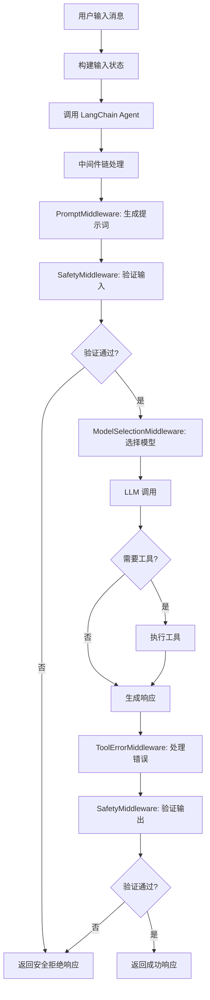
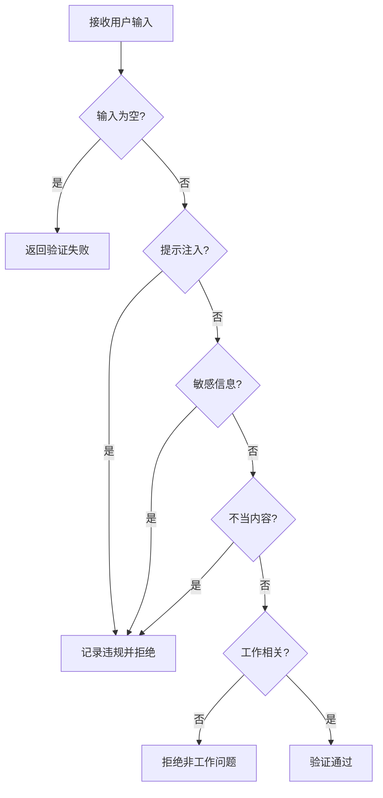
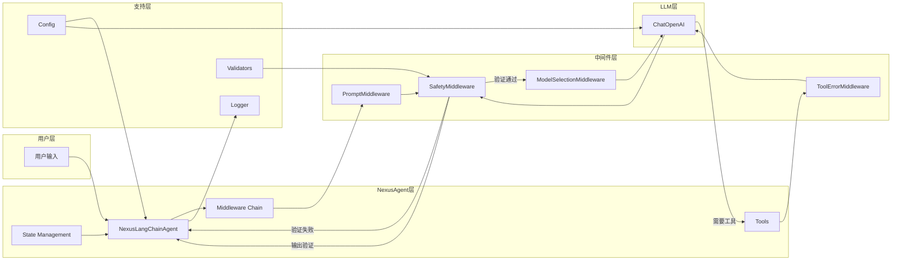

# 📚 Nexus Agent 项目学习指南

> 本文档详细介绍了 Nexus Agent 项目的架构、核心模块和代码实现，帮助你快速理解和学习项目代码。

---

## 目录

1. [项目概述](#1-项目概述)
2. [项目架构](#2-项目架构)
3. [核心模块详解](#3-核心模块详解)
4. [完整数据流图](#4-完整数据流图)
5. [使用示例](#5-使用示例)
6. [学习路径建议](#6-学习路径建议)
7. [关键设计模式](#7-关键设计模式)
8. [扩展建议](#8-扩展建议)

---

## 1. 项目概述

### 1.1 项目简介

**Nexus Agent** 是一个基于 LangChain 1.0 的智能对话系统，专为帮助新员工快速适应工作环境而设计。项目采用了 LangChain 的 `create_agent` API，结合中间件架构实现安全检查、动态模型选择和工具调用。

### 1.2 核心特性

| 特性 | 说明 |
|------|------|
| 🔒 安全可靠 | 内置输入/输出验证，防止提示注入和敏感信息泄露 |
| 🤖 多提供商支持 | 支持 OpenAI、DeepSeek、Qwen 等多种 LLM 提供商 |
| 💬 多轮对话 | 支持上下文感知的多轮对话 |
| 🛠️ 工具调用 | 内置公司政策查询、联系方式获取等工具 |
| 📊 监控追踪 | 完整的日志记录和 Token 使用追踪 |
| 🧪 测试完善 | 包含全面的安全测试和对话流程测试 |
| 🔧 易于配置 | 通过环境变量灵活配置 |
| ⚡ 中间件架构 | 使用 LangChain 1.0 中间件模式，模块化可扩展 |

### 1.3 技术栈

- **语言**: Python 3.12+
- **框架**: LangChain 1.0 (使用 `create_agent` API)
- **配置管理**: Pydantic Settings
- **日志**: Rich Logging
- **包管理**: UV (推荐) 或 pip

---

## 2. 项目架构

### 2.1 整体架构图

```
┌─────────────────────────────────────────────────────────────┐
│                 NexusLangChainAgent (核心控制器)            │
│  ┌──────────────┐  ┌──────────────┐  ┌──────────────┐      │
│  │   Tools      │  │ Middleware   │  │   State      │      │
│  │  (工具调用)   │  │ (中间件链)    │  │  (状态管理)   │      │
│  └──────────────┘  └──────────────┘  └──────────────┘      │
└─────────────────────────────────────────────────────────────┘
          │                    │                    │
          ▼                    ▼                    ▼
   ┌──────────────┐  ┌──────────────┐  ┌──────────────┐
   │   Config     │  │   Logger     │  │  Validators  │
   │  (配置管理)   │  │  (日志记录)   │  │  (安全验证)   │
   └──────────────┘  └──────────────┘  └──────────────┘
```

### 2.2 中间件架构图

```
用户输入
    ↓
┌─────────────────────────────────────────────────┐
│  NexusPromptMiddleware (动态提示词生成)          │
│  - 根据用户角色定制系统提示词                     │
└─────────────────────────────────────────────────┘
    ↓
┌─────────────────────────────────────────────────┐
│  SafetyMiddleware (安全验证)                     │
│  - 输入验证：提示注入、敏感信息检测               │
│  - 输出验证：角色保持、内容适当性                 │
└─────────────────────────────────────────────────┘
    ↓
┌─────────────────────────────────────────────────┐
│  NexusModelSelectionMiddleware (模型选择)       │
│  - 根据对话复杂度动态选择模型                    │
│  - 支持多提供商切换                             │
└─────────────────────────────────────────────────┘
    ↓
┌─────────────────────────────────────────────────┐
│  ToolErrorMiddleware (工具错误处理)              │
│  - 捕获工具执行错误                              │
│  - 返回用户友好的错误消息                        │
└─────────────────────────────────────────────────┘
    ↓
LLM 调用
    ↓
工具调用（如需要）
    ↓
用户响应
```

### 2.3 目录结构

```
nexus-agent/
├── nexus_agent/
│   ├── agent/              # 核心 Agent 模块
│   │   ├── agent.py        # 主 Agent 实现（使用 create_agent）
│   │   ├── middleware.py   # 中间件实现
│   │   ├── state.py        # 状态管理
│   │   ├── tools.py        # 工具定义
│   │   ├── prompts.py      # 系统提示词
│   │   └── __init__.py
│   ├── config/             # 配置管理
│   │   ├── settings.py     # 配置类
│   │   └── __init__.py
│   ├── tests/              # 测试套件
│   │   ├── test_prompts.py      # 提示词安全测试
│   │   ├── test_conversation.py # 对话流程测试
│   │   └── __init__.py
│   ├── utils/              # 工具模块
│   │   ├── logger.py       # 日志工具
│   │   ├── validators.py   # 输入/输出验证
│   │   └── __init__.py
│   └── __init__.py
├── plans/                  # 项目规划文档
│   ├── sprint1-prototype-plan.md
│   └── langchain-1.0-syntax-guide.md
├── demo_script.py          # 演示脚本
├── main.py                 # 主入口
├── pyproject.toml          # 项目配置
├── .env.example           # 环境变量示例
├── README.md              # 项目文档
└── PROJECT_GUIDE.md       # 本学习指南
```

---

## 3. 核心模块详解

### 3.1 nexus_agent/agent/agent.py - 核心控制器

#### 主要类

##### NexusLangChainAgent
主 Agent 类，使用 LangChain 1.0 的 `create_agent` API 构建。

**初始化参数:**
```python
def __init__(self,
             provider: str = None,              # LLM 提供商
             model: str = None,                 # 模型名称
             temperature: float = None,         # 响应随机性
             enable_safety_checks: bool = True) # 启用安全检查
```

**核心方法:**

| 方法 | 说明 | 文件位置 |
|------|------|----------|
| [`process_message()`](nexus_agent/agent/agent.py:134) | 处理用户消息 | agent.py:134 |
| [`stream_message()`](nexus_agent/agent/agent.py:222) | 流式响应 | agent.py:222 |
| [`chat()`](nexus_agent/agent/agent.py:273) | 简化对话接口 | agent.py:273 |
| [`interactive_chat()`](nexus_agent/agent/agent.py:278) | 启动交互式对话 | agent.py:278 |
| [`get_agent_info()`](nexus_agent/agent/agent.py:323) | 获取 Agent 信息 | agent.py:323 |
| [`test_connection()`](nexus_agent/agent/agent.py:335) | 测试连接 | agent.py:335 |

##### AgentResponse
响应数据类，包含所有响应信息。

```python
@dataclass
class AgentResponse:
    content: str                      # 响应内容
    success: bool                     # 是否成功
    error: Optional[str] = None        # 错误信息
    tokens_used: Optional[Dict] = None # Token 使用统计
    duration: Optional[float] = None  # 响应时间
    context_id: Optional[str] = None  # 对话 ID
    metadata: Optional[Dict] = None   # 额外元数据
    tool_calls: Optional[List[Dict]] = None  # 工具调用记录
```

#### 消息处理流程图



---

### 3.2 nexus_agent/agent/middleware.py - 中间件实现

#### 主要类

##### SafetyMiddleware
安全验证中间件，在模型调用前后进行输入/输出验证。

**核心方法:**

| 方法 | 说明 | 文件位置 |
|------|------|----------|
| [`before_model()`](nexus_agent/agent/middleware.py:33) | 模型调用前验证输入 | middleware.py:33 |

**验证项:**

| 类别 | 检测内容 | 示例模式 |
|------|----------|----------|
| 提示注入 | ignore/forget/disregard 指令 | `(?i)(ignore\|forget).*previous.*instruction` |
| 敏感信息 | salary/password/personal data | `(?i)(salary\|password).*information` |
| 不当内容 | hack/crack/illegal | `(?i)(hack\|crack).*system` |
| 工作相关性 | 是否包含工作关键词 | work, job, company, 工作, 公司 |

##### NexusModelSelectionMiddleware
动态模型选择中间件，根据对话复杂度选择合适的模型。

**核心方法:**

| 方法 | 说明 | 文件位置 |
|------|------|----------|
| [`select_model()`](nexus_agent/agent/middleware.py:97) | 选择合适的模型 | middleware.py:97 |

**选择策略:**
- 短对话（< 10 条消息）：使用轻量级模型（如 gpt-4o-mini）
- 长对话（≥ 10 条消息）：使用高级模型（如 gpt-4o）

##### NexusPromptMiddleware
动态提示词生成中间件，根据用户角色定制系统提示词。

**核心方法:**

| 方法 | 说明 | 文件位置 |
|------|------|----------|
| [`generate_prompt()`](nexus_agent/agent/middleware.py:172) | 生成动态系统提示词 | middleware.py:172 |

**定制选项:**
- 新员工：提供更详细和耐心的解释
- 管理者：提供更简洁和专业的回答

##### ToolErrorMiddleware
工具错误处理中间件，捕获工具执行错误并返回友好消息。

**核心方法:**

| 方法 | 说明 | 文件位置 |
|------|------|----------|
| [`handle_tool_errors()`](nexus_agent/agent/middleware.py:197) | 处理工具执行错误 | middleware.py:197 |

---

### 3.3 nexus_agent/agent/state.py - 状态管理

#### 主要类

##### NexusAgentState
扩展的 Agent 状态类，继承自 LangChain 的 `AgentState`。

```python
class NexusAgentState(AgentState):
    """Extended state for Nexus Agent"""
    user_id: Optional[str] = None           # 用户 ID
    session_id: Optional[str] = None        # 会话 ID
    user_preferences: Dict[str, Any] = {}   # 用户偏好
    conversation_stats: Dict[str, int] = {} # 对话统计
```

---

### 3.4 nexus_agent/agent/tools.py - 工具定义

#### 可用工具

| 工具名称 | 说明 | 参数 |
|---------|------|------|
| [`lookup_company_policy()`](nexus_agent/agent/tools.py:11) | 查询公司政策 | topic (政策主题) |
| [`get_contact_info()`](nexus_agent/agent/tools.py:40) | 获取部门联系方式 | department (部门名称) |
| [`search_knowledge_base()`](nexus_agent/agent/tools.py:66) | 搜索知识库 | query (搜索查询) |
| [`get_onboarding_guide()`](nexus_agent/agent/tools.py:104) | 获取入职指南 | step (可选步骤) |

#### 工具实现示例

```python
@tool
def lookup_company_policy(topic: str) -> str:
    """Look up company policies and procedures.
    
    Args:
        topic: The policy topic to search for (e.g., 'expense', 'leave', 'onboarding')
    
    Returns:
        Information about the requested policy topic
    """
    policies = {
        "expense": "公司报销政策：员工需要提交费用报销单，附上相关发票...",
        "leave": "请假政策：员工需提前通过HR系统提交请假申请...",
        "onboarding": "新员工入职流程：1. 完成入职表格 2. 领取设备...",
        # ... 更多政策
    }
    
    for key in policies:
        if key in topic.lower():
            return policies[key]
    
    return policies["default"]
```

---

### 3.5 nexus_agent/agent/prompts.py - 提示词管理

#### 提示词类型

##### BASE_SYSTEM_PROMPT
基础系统提示词，定义助手的角色和能力。

**包含内容:**
- 角色定位
- 核心能力
- 交互原则
- 安全边界
- 可用工具列表

##### get_system_prompt()
根据用户角色定制系统提示词。

**参数:**
- `user_role`: 用户角色（如 "new_employee", "manager"）

**定制示例:**
```python
def get_system_prompt(user_role: str = "new_employee") -> str:
    prompt = BASE_SYSTEM_PROMPT
    
    if user_role == "new_employee":
        prompt += "\n\n## 特别说明\n用户是新员工，请提供更详细和耐心的解释..."
    elif user_role == "manager":
        prompt += "\n\n## 特别说明\n用户是管理者，请提供更简洁和专业的回答..."
    
    return prompt
```

---

### 3.6 nexus_agent/utils/validators.py - 安全验证器

#### 主要类

##### InputValidator
输入验证器，检测潜在的安全威胁。

**验证项:**

| 类别 | 检测内容 | 示例模式 |
|------|----------|----------|
| 提示注入 | ignore/forget/disregard 指令 | `(?i)(ignore\|forget).*previous.*instruction` |
| 敏感信息 | salary/password/personal data | `(?i)(salary\|password).*information` |
| 不当内容 | hack/crack/illegal | `(?i)(hack\|crack).*system` |
| 工作相关性 | 是否包含工作关键词 | work, job, company, 工作, 公司 |

##### OutputValidator
输出验证器，确保响应内容安全适当。

**验证项:**

| 类别 | 检测内容 | 示例模式 |
|------|----------|----------|
| 角色保持 | 是否保持助手身份 | `(?i)(i am\|我是).*(not\|不是).*nexus` |
| 禁止内容 | 是否包含敏感信息 | `(?i)(here's\|这是).*(password\|secret)` |
| 适当性 | 回复是否得体 | 检查礼貌用语 |

##### MessageHandler
消息处理器，结合输入和输出验证。

**核心方法:**

| 方法 | 说明 | 文件位置 |
|------|------|----------|
| [`validate_input()`](nexus_agent/utils/validators.py:191) | 验证输入 | validators.py:191 |
| [`validate_output()`](nexus_agent/utils/validators.py:199) | 验证输出 | validators.py:199 |
| [`get_validation_details()`](nexus_agent/utils/validators.py:207) | 获取详细验证结果 | validators.py:207 |

##### ValidationResult
验证结果数据类。

```python
@dataclass
class ValidationResult:
    is_valid: bool    # 是否有效
    reason: str       # 原因说明
    action: str       # 操作类型: allow/block/modify
```

#### 输入验证流程图



---

### 3.7 nexus_agent/utils/logger.py - 日志系统

#### 主要类

##### NexusLogger
结构化日志记录器。

**日志方法:**

| 方法 | 说明 | 文件位置 |
|------|------|----------|
| [`log_conversation()`](nexus_agent/utils/logger.py:55) | 记录对话 | logger.py:55 |
| [`log_error()`](nexus_agent/utils/logger.py:66) | 记录错误 | logger.py:66 |
| [`log_llm_call()`](nexus_agent/utils/logger.py:77) | 记录 LLM 调用 | logger.py:77 |
| [`log_safety_violation()`](nexus_agent/utils/logger.py:89) | 记录安全违规 | logger.py:89 |
| [`log_system_event()`](nexus_agent/utils/logger.py:100) | 记录系统事件 | logger.py:100 |

**日志格式示例:**

```json
{
  "timestamp": "2024-01-01T12:00:00.000Z",
  "event_type": "conversation",
  "user_input": "你好，我是新员工",
  "agent_response": "欢迎加入公司！...",
  "metadata": {
    "context_id": "user1_session1",
    "duration": 1.23,
    "tool_calls_count": 2
  }
}
```

---

### 3.8 nexus_agent/config/settings.py - 配置管理

#### 主要类

##### NexusConfig
使用 Pydantic 的配置类。

**配置项:**

| 配置项 | 类型 | 默认值 | 说明 |
|--------|------|--------|------|
| `llm_provider` | Literal | "openai" | LLM 提供商 |
| `llm_model` | str | "gpt-4o" | 模型名称 |
| `temperature` | float | 0.7 | 响应随机性 (0.0-2.0) |
| `openai_api_key` | Optional[str] | None | OpenAI API 密钥 |
| `deepseek_api_key` | Optional[str] | None | DeepSeek API 密钥 |
| `qwen_api_key` | Optional[str] | None | Qwen API 密钥 |
| `log_level` | Literal | "INFO" | 日志级别 |
| `log_file` | Optional[str] | None | 日志文件路径 |
| `max_conversation_length` | int | 10 | 最大对话长度 |
| `enable_safety_checks` | bool | True | 启用安全检查 |
| `max_retries` | int | 3 | 最大重试次数 |
| `retry_delay` | float | 1.0 | 重试延迟（秒） |
| `max_tokens` | int | 1000 | 最大 Token 数 |

---

## 4. 完整数据流图



---

## 5. 使用示例

### 5.1 基础用法

```python
from nexus_agent.agent.agent import create_nexus_agent

# 创建 agent
agent = create_nexus_agent()

# 发送消息
response = agent.process_message("你好，我是新员工")
print(response.content)
```

### 5.2 交互式对话

```python
from nexus_agent.agent.agent import NexusLangChainAgent

agent = NexusLangChainAgent()
agent.interactive_chat()
```

### 5.3 流式响应

```python
from nexus_agent.agent.agent import create_nexus_agent

agent = create_nexus_agent()

# 流式处理消息
for chunk in agent.stream_message("请介绍一下公司的报销政策"):
    if chunk["type"] == "message":
        print(chunk["content"], end="", flush=True)
    elif chunk["type"] == "tool_calls":
        print(f"\n[使用了工具: {len(chunk['tool_calls'])} 个]")
    elif chunk["type"] == "error":
        print(f"\n错误: {chunk['error']}")
```

### 5.4 自定义配置

```python
from nexus_agent.agent.agent import NexusLangChainAgent

# 使用自定义配置
agent = NexusLangChainAgent(
    provider="deepseek",
    model="deepseek-chat",
    temperature=0.5,
    enable_safety_checks=True
)
```

### 5.5 使用用户偏好

```python
from nexus_agent.agent.agent import create_nexus_agent

agent = create_nexus_agent()

# 为新员工提供详细解释
response = agent.process_message(
    "我应该如何申请年假？",
    user_preferences={"role": "new_employee"}
)

# 为管理者提供简洁回答
response = agent.process_message(
    "年假政策是什么？",
    user_preferences={"role": "manager"}
)
```

### 5.6 获取 Agent 信息

```python
from nexus_agent.agent.agent import create_nexus_agent

agent = create_nexus_agent()

# 获取 agent 配置信息
info = agent.get_agent_info()
print(f"Provider: {info['provider']}")
print(f"Model: {info['model']}")
print(f"Tools: {info['tools']}")
print(f"Middleware count: {info['middleware_count']}")
```

---

## 6. 学习路径建议

### 第一阶段：理解核心概念
1. 阅读 [`README.md`](README.md) - 了解项目概述和快速开始
2. 阅读 [`PROJECT_GUIDE.md`](PROJECT_GUIDE.md) - 本文档，了解整体架构
3. 阅读 [`plans/langchain-1.0-syntax-guide.md`](plans/langchain-1.0-syntax-guide.md) - 了解 LangChain 1.0 语法

### 第二阶段：深入核心模块
1. 阅读 [`nexus_agent/agent/agent.py`](nexus_agent/agent/agent.py) - 理解 `NexusLangChainAgent` 类的核心逻辑
2. 学习 [`nexus_agent/agent/middleware.py`](nexus_agent/agent/middleware.py) - 了解中间件架构
3. 研究 [`nexus_agent/agent/tools.py`](nexus_agent/agent/tools.py) - 理解工具调用机制
4. 查看 [`nexus_agent/utils/validators.py`](nexus_agent/utils/validators.py) - 理解安全验证机制

### 第三阶段：掌握辅助功能
1. 阅读 [`nexus_agent/agent/state.py`](nexus_agent/agent/state.py) - 学习状态管理
2. 查看 [`nexus_agent/agent/prompts.py`](nexus_agent/agent/prompts.py) - 理解提示词管理
3. 学习 [`nexus_agent/utils/logger.py`](nexus_agent/utils/logger.py) - 了解日志系统
4. 查看 [`nexus_agent/config/settings.py`](nexus_agent/config/settings.py) - 理解配置管理

### 第四阶段：实践运行
1. 运行 [`demo_script.py`](demo_script.py) - 观察实际运行效果
2. 运行测试套件 - 理解测试用例
3. 尝试修改配置 - 观察不同配置的效果
4. 使用交互式对话模式 - 体验多轮对话

### 第五阶段：扩展开发
1. 添加新的 LLM 提供商支持
2. 实现新的中间件
3. 添加新的工具
4. 实现新的验证规则
5. 集成向量数据库实现 RAG

---

## 7. 关键设计模式

### 7.1 中间件模式 (Middleware Pattern)

LangChain 1.0 的核心设计模式，通过中间件链处理请求和响应。

```python
# 中间件链
self.middleware = [
    SafetyMiddleware(),
    NexusModelSelectionMiddleware(),
    NexusPromptMiddleware(),
    ToolErrorMiddleware()
]

# 在 create_agent 中使用
self.agent = create_agent(
    model=self.base_model,
    tools=self.tools,
    state_schema=NexusAgentState,
    middleware=self.middleware,
    system_prompt=BASE_SYSTEM_PROMPT
)
```

### 7.2 责任链模式 (Chain of Responsibility)

中间件按顺序处理请求，每个中间件可以决定是否继续传递。

```python
# SafetyMiddleware.before_model()
def before_model(self, state: NexusAgentState, runtime) -> Optional[Dict[str, Any]]:
    # 验证输入
    if not validation_result.is_valid:
        # 返回响应，阻止后续中间件执行
        return {
            "skip_model": True,
            "safety_violation": True,
            "response": "抱歉，我无法处理这个请求。"
        }
    # 继续传递
    return None
```

### 7.3 工厂模式 (Factory Pattern)

[`create_nexus_agent()`](nexus_agent/agent/agent.py:346) 函数用于创建 Agent 实例。

```python
def create_nexus_agent(**kwargs) -> NexusLangChainAgent:
    """Create a Nexus Agent with default or custom configuration"""
    return NexusLangChainAgent(**kwargs)
```

### 7.4 策略模式 (Strategy Pattern)

不同的中间件实现不同的处理策略。

```python
# 策略 1: 安全验证
SafetyMiddleware()

# 策略 2: 模型选择
NexusModelSelectionMiddleware()

# 策略 3: 动态提示词
NexusPromptMiddleware()

# 策略 4: 错误处理
ToolErrorMiddleware()
```

### 7.5 观察者模式 (Observer Pattern)

日志系统记录所有关键事件。

```python
# 在各个模块中记录事件
self.logger.log_conversation(user_input, agent_response, metadata)
self.logger.log_llm_call(messages, response, tokens_used, duration)
self.logger.log_safety_violation(violation_type, content, action)
self.logger.log_system_event("agent_initialized", {...})
```

### 7.6 装饰器模式 (Decorator Pattern)

LangChain 使用装饰器包装中间件方法。

```python
# 使用装饰器包装方法
select_model = wrap_model_call(select_model)
handle_tool_errors = wrap_tool_call(handle_tool_errors)
generate_prompt = dynamic_prompt(generate_prompt)
```

---

## 8. 扩展建议

### 8.1 添加新的 LLM 提供商

在 [`nexus_agent/agent/agent.py`](nexus_agent/agent/agent.py) 的 `_get_model()` 方法中添加新的提供商支持：

```python
def _get_model(self) -> ChatOpenAI:
    """Get the base model based on provider"""
    if self.provider == "openai":
        return ChatOpenAI(
            model=self.model,
            temperature=self.temperature,
            openai_api_key=config.openai_api_key
        )
    elif self.provider == "new_provider":
        return ChatOpenAI(
            model=self.model or "new-model",
            temperature=self.temperature,
            openai_api_key=config.new_provider_api_key,
            openai_api_base="https://api.new-provider.com"
        )
    # ... 其他提供商
```

### 8.2 添加新的中间件

创建新的中间件类并添加到中间件链：

```python
from langchain.agents.middleware import AgentMiddleware

class CustomMiddleware(AgentMiddleware):
    """自定义中间件"""
    
    def __init__(self):
        super().__init__()
        self.logger = get_logger("custom_middleware")
    
    def before_model(self, state: NexusAgentState, runtime) -> Optional[Dict[str, Any]]:
        # 自定义处理逻辑
        self.logger.log_system_event("custom_middleware_triggered", {})
        return None

# 在 NexusLangChainAgent.__init__() 中添加
self.middleware.append(CustomMiddleware())
```

### 8.3 添加新的工具

在 [`nexus_agent/agent/tools.py`](nexus_agent/agent/tools.py) 中添加新工具：

```python
from langchain.tools import tool

@tool
def custom_tool(param: str) -> str:
    """自定义工具描述
    
    Args:
        param: 参数说明
    
    Returns:
        返回值说明
    """
    # 实现工具逻辑
    return f"处理结果: {param}"

# 添加到 NEXUS_TOOLS 列表
NEXUS_TOOLS = [
    lookup_company_policy,
    get_contact_info,
    search_knowledge_base,
    get_onboarding_guide,
    custom_tool  # 添加新工具
]
```

### 8.4 实现 RAG（检索增强生成）

添加向量数据库集成和文档检索功能：

```python
from langchain_community.vectorstores import Chroma
from langchain_community.embeddings import OpenAIEmbeddings
from langchain.tools import tool

@tool
def search_documents(query: str) -> str:
    """搜索公司文档
    
    Args:
        query: 搜索查询
    
    Returns:
        相关文档内容
    """
    # 初始化向量数据库
    vector_store = Chroma(
        persist_directory="./chroma_db",
        embedding_function=OpenAIEmbeddings()
    )
    
    # 搜索相关文档
    docs = vector_store.similarity_search(query, k=3)
    
    # 返回搜索结果
    return "\n\n".join([doc.page_content for doc in docs])
```

### 8.5 集成向量数据库

支持多种向量数据库：

- Chroma
- FAISS
- Pinecone
- Weaviate

### 8.6 开发 Web 界面

使用 Streamlit 或 FastAPI 创建 Web UI：

```python
import streamlit as st
from nexus_agent.agent.agent import create_nexus_agent

st.title("Nexus Agent - 新员工入职助手")

agent = create_nexus_agent()

user_input = st.text_input("请输入您的问题:")

if st.button("发送"):
    response = agent.process_message(user_input)
    st.write(response.content)
    
    if response.tool_calls:
        st.write(f"使用了 {len(response.tool_calls)} 个工具")
```

### 8.7 添加对话历史持久化

实现对话历史的数据库存储：

```python
import sqlite3
from typing import List, Dict

class ConversationStore:
    """对话历史存储"""
    
    def __init__(self, db_path: str = "conversations.db"):
        self.conn = sqlite3.connect(db_path)
        self._create_tables()
    
    def _create_tables(self):
        self.conn.execute("""
            CREATE TABLE IF NOT EXISTS conversations (
                id INTEGER PRIMARY KEY AUTOINCREMENT,
                context_id TEXT NOT NULL,
                user_input TEXT NOT NULL,
                agent_response TEXT NOT NULL,
                timestamp DATETIME DEFAULT CURRENT_TIMESTAMP
            )
        """)
    
    def save_conversation(self, context_id: str, user_input: str, agent_response: str):
        self.conn.execute(
            "INSERT INTO conversations (context_id, user_input, agent_response) VALUES (?, ?, ?)",
            (context_id, user_input, agent_response)
        )
        self.conn.commit()
    
    def get_conversation_history(self, context_id: str, limit: int = 10) -> List[Dict]:
        cursor = self.conn.execute(
            "SELECT user_input, agent_response FROM conversations WHERE context_id = ? ORDER BY timestamp DESC LIMIT ?",
            (context_id, limit)
        )
        return [{"user": row[0], "assistant": row[1]} for row in cursor.fetchall()]
```

---

## 附录

### A. 相关文件索引

| 文件 | 说明 | 优先级 |
|------|------|--------|
| [`README.md`](README.md) | 项目文档 | ⭐⭐⭐ |
| [`PROJECT_GUIDE.md`](PROJECT_GUIDE.md) | 本学习指南 | ⭐⭐⭐ |
| [`nexus_agent/agent/agent.py`](nexus_agent/agent/agent.py) | 核心 Agent | ⭐⭐⭐ |
| [`nexus_agent/agent/middleware.py`](nexus_agent/agent/middleware.py) | 中间件实现 | ⭐⭐⭐ |
| [`nexus_agent/agent/tools.py`](nexus_agent/agent/tools.py) | 工具定义 | ⭐⭐⭐ |
| [`nexus_agent/utils/validators.py`](nexus_agent/utils/validators.py) | 安全验证器 | ⭐⭐⭐ |
| [`nexus_agent/agent/state.py`](nexus_agent/agent/state.py) | 状态管理 | ⭐⭐ |
| [`nexus_agent/agent/prompts.py`](nexus_agent/agent/prompts.py) | 提示词管理 | ⭐⭐ |
| [`nexus_agent/utils/logger.py`](nexus_agent/utils/logger.py) | 日志系统 | ⭐⭐ |
| [`nexus_agent/config/settings.py`](nexus_agent/config/settings.py) | 配置管理 | ⭐⭐ |
| [`demo_script.py`](demo_script.py) | 演示脚本 | ⭐⭐ |

### B. 测试文件

| 文件 | 说明 |
|------|------|
| [`nexus_agent/tests/test_prompts.py`](nexus_agent/tests/test_prompts.py) | 提示词安全测试 |
| [`nexus_agent/tests/test_conversation.py`](nexus_agent/tests/test_conversation.py) | 对话流程测试 |

### C. 规划文档

| 文件 | 说明 |
|------|------|
| [`plans/sprint1-prototype-plan.md`](plans/sprint1-prototype-plan.md) | Sprint 1 原型计划 |
| [`plans/langchain-1.0-syntax-guide.md`](plans/langchain-1.0-syntax-guide.md) | LangChain 1.0 语法指南 |

### D. LangChain 1.0 关键概念

#### create_agent API
LangChain 1.0 的核心 API，用于创建具有工具调用能力的 Agent。

```python
from langchain.agents import create_agent

agent = create_agent(
    model=base_model,
    tools=tools,
    state_schema=AgentState,
    middleware=middleware,
    system_prompt=system_prompt
)
```

#### 中间件装饰器
LangChain 1.0 提供的装饰器，用于包装中间件方法。

- `wrap_model_call()`: 包装模型调用
- `wrap_tool_call()`: 包装工具调用
- `dynamic_prompt()`: 动态生成提示词

#### 状态管理
使用 Pydantic 模型定义 Agent 状态。

```python
from langchain.agents import AgentState

class NexusAgentState(AgentState):
    user_id: Optional[str] = None
    session_id: Optional[str] = None
    user_preferences: Dict[str, Any] = {}
    conversation_stats: Dict[str, int] = {}
```

---

**祝你学习愉快！如有问题，请随时查阅相关代码或提出问题。** 🚀
