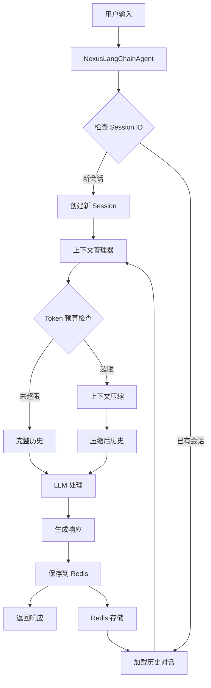
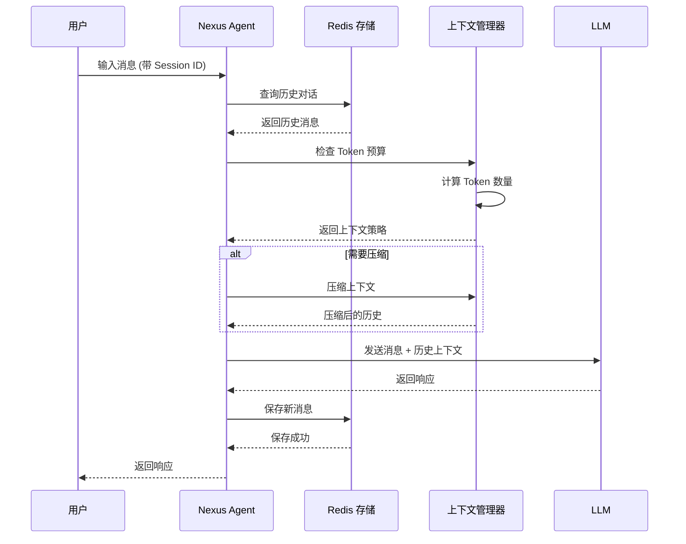
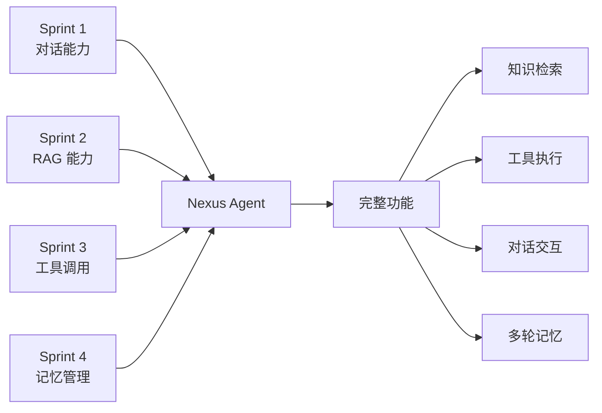

# Sprint 4: 记忆管理与多轮对话 (The "Context")

## 🎯 Sprint Objective

**目标：** 实现像人一样的连续对话能力，而不是"金鱼记忆"。

为 Nexus Agent 添加持久化记忆管理能力，使其能够记住用户的历史对话，区分不同用户的会话，并实现长对话的上下文管理。通过 Redis 持久化存储和智能上下文压缩，让 Agent 具备真正的"记忆"。

**状态：** 🔄 规划中
**预计开始日期：** 2026-01-08
**预计结束日期：** 2026-01-22

---

## 📋 Sprint Overview

**Duration:** 2 周
**Focus Area:** Memory Management & Multi-turn Conversation (The "Context")
**Key Deliverables:**
- Redis 持久化存储集成
- Session ID 机制实现
- 对话历史管理
- Token 预算和上下文压缩
- 多轮对话测试和演示

---

## 🏗️ Technical Architecture

### 整体架构图



### 对话历史管理流程



---

## 📝 Detailed Implementation Plan

### 1. Redis 持久化存储集成

#### 1.1 安装和配置 Redis

**任务：**
- 安装 Redis 服务器
- 配置 Redis 连接
- 实现连接池管理

**文件：** [`nexus_agent/storage/redis_client.py`](../nexus_agent/storage/redis_client.py) - **新建**

```python
"""
Redis 客户端 - Sprint 4
用于持久化存储对话历史和会话信息
"""

import json
from typing import Dict, List, Optional, Any
from datetime import datetime
import redis
from redis.connection import ConnectionPool
from nexus_agent.config.settings import config


class RedisClient:
    """Redis 客户端封装"""
    
    def __init__(self):
        """初始化 Redis 连接"""
        # 创建连接池
        self.pool = ConnectionPool(
            host=config.redis_host,
            port=config.redis_port,
            db=config.redis_db,
            password=config.redis_password,
            decode_responses=True,  # 自动解码为字符串
            socket_connect_timeout=5,
            socket_timeout=5,
            retry_on_timeout=True
        )
        
        # 创建 Redis 客户端
        self.client = redis.Redis(connection_pool=self.pool)
        
        # 测试连接
        try:
            self.client.ping()
            print("✅ Redis 连接成功")
        except Exception as e:
            print(f"❌ Redis 连接失败: {e}")
            raise
    
    def get_session(self, session_id: str) -> Optional[Dict]:
        """
        获取会话信息
        
        Args:
            session_id: 会话 ID
            
        Returns:
            会话信息字典，如果不存在则返回 None
        """
        key = f"session:{session_id}"
        data = self.client.get(key)
        
        if data:
            return json.loads(data)
        return None
    
    def save_session(self, session_id: str, session_data: Dict) -> bool:
        """
        保存会话信息
        
        Args:
            session_id: 会话 ID
            session_data: 会话数据
            
        Returns:
            是否保存成功
        """
        key = f"session:{session_id}"
        try:
            # 设置过期时间（7天）
            self.client.setex(
                key,
                config.session_ttl,
                json.dumps(session_data, ensure_ascii=False)
            )
            return True
        except Exception as e:
            print(f"❌ 保存会话失败: {e}")
            return False
    
    def get_conversation_history(
        self,
        session_id: str,
        limit: Optional[int] = None
    ) -> List[Dict]:
        """
        获取对话历史
        
        Args:
            session_id: 会话 ID
            limit: 限制返回的消息数量（可选）
            
        Returns:
            消息列表
        """
        key = f"history:{session_id}"
        
        try:
            # 获取所有消息
            messages = self.client.lrange(key, 0, -1)
            
            # 反转列表（Redis 返回的是从旧到新）
            messages = messages[::-1]
            
            # 解析 JSON
            history = [json.loads(msg) for msg in messages]
            
            # 应用限制
            if limit:
                history = history[-limit:]
            
            return history
        except Exception as e:
            print(f"❌ 获取对话历史失败: {e}")
            return []
    
    def add_message(
        self,
        session_id: str,
        role: str,
        content: str,
        metadata: Optional[Dict] = None
    ) -> bool:
        """
        添加消息到对话历史
        
        Args:
            session_id: 会话 ID
            role: 角色 (user/assistant/system)
            content: 消息内容
            metadata: 元数据（可选）
            
        Returns:
            是否添加成功
        """
        key = f"history:{session_id}"
        
        message = {
            "role": role,
            "content": content,
            "timestamp": datetime.now().isoformat(),
            "metadata": metadata or {}
        }
        
        try:
            # 添加到列表头部
            self.client.lpush(key, json.dumps(message, ensure_ascii=False))
            
            # 设置过期时间
            self.client.expire(key, config.session_ttl)
            
            # 限制历史长度
            max_length = config.max_history_length
            if max_length:
                self.client.ltrim(key, 0, max_length - 1)
            
            return True
        except Exception as e:
            print(f"❌ 添加消息失败: {e}")
            return False
    
    def clear_history(self, session_id: str) -> bool:
        """
        清空对话历史
        
        Args:
            session_id: 会话 ID
            
        Returns:
            是否清空成功
        """
        key = f"history:{session_id}"
        try:
            self.client.delete(key)
            return True
        except Exception as e:
            print(f"❌ 清空历史失败: {e}")
            return False
    
    def delete_session(self, session_id: str) -> bool:
        """
        删除会话
        
        Args:
            session_id: 会话 ID
            
        Returns:
            是否删除成功
        """
        try:
            # 删除会话信息
            self.client.delete(f"session:{session_id}")
            # 删除对话历史
            self.client.delete(f"history:{session_id}")
            return True
        except Exception as e:
            print(f"❌ 删除会话失败: {e}")
            return False
    
    def get_all_sessions(self) -> List[Dict]:
        """
        获取所有会话列表
        
        Returns:
            会话列表
        """
        try:
            # 获取所有 session key
            keys = self.client.keys("session:*")
            
            sessions = []
            for key in keys:
                session_id = key.split(":")[1]
                session_data = self.get_session(session_id)
                if session_data:
                    sessions.append({
                        "session_id": session_id,
                        **session_data
                    })
            
            return sessions
        except Exception as e:
            print(f"❌ 获取会话列表失败: {e}")
            return []
    
    def close(self):
        """关闭 Redis 连接"""
        try:
            self.pool.disconnect()
            print("✅ Redis 连接已关闭")
        except Exception as e:
            print(f"❌ 关闭 Redis 连接失败: {e}")


# 全局 Redis 客户端实例
redis_client = None


def get_redis_client() -> RedisClient:
    """
    获取 Redis 客户端实例（单例模式）
    
    Returns:
        RedisClient 实例
    """
    global redis_client
    if redis_client is None:
        redis_client = RedisClient()
    return redis_client
```

#### 1.2 更新配置文件

**文件：** [`nexus_agent/config/settings.py`](../nexus_agent/config/settings.py) - **修改**

```python
# Redis 配置
redis_host: str = os.getenv("REDIS_HOST", "localhost")
redis_port: int = int(os.getenv("REDIS_PORT", "6379"))
redis_db: int = int(os.getenv("REDIS_DB", "0"))
redis_password: Optional[str] = os.getenv("REDIS_PASSWORD", None)

# 会话管理配置
session_ttl: int = 60 * 60 * 24 * 7  # 7天（秒）
max_history_length: int = 100  # 最大历史消息数
max_context_tokens: int = 4000  # 最大上下文 Token 数
context_compression_threshold: float = 0.8  # 压缩阈值（80%）
```

---

### 2. Session ID 机制实现

#### 2.1 Session 管理器

**文件：** [`nexus_agent/storage/session_manager.py`](../nexus_agent/storage/session_manager.py) - **新建**

```python
"""
会话管理器 - Sprint 4
管理用户会话和对话历史
"""

import uuid
from typing import Dict, Optional, List
from datetime import datetime
from .redis_client import get_redis_client


class SessionManager:
    """会话管理器"""
    
    def __init__(self):
        """初始化会话管理器"""
        self.redis = get_redis_client()
    
    def create_session(
        self,
        user_id: Optional[str] = None,
        metadata: Optional[Dict] = None
    ) -> str:
        """
        创建新会话
        
        Args:
            user_id: 用户 ID（可选）
            metadata: 会话元数据（可选）
            
        Returns:
            会话 ID
        """
        # 生成唯一会话 ID
        session_id = str(uuid.uuid4())
        
        # 创建会话数据
        session_data = {
            "session_id": session_id,
            "user_id": user_id,
            "created_at": datetime.now().isoformat(),
            "last_active": datetime.now().isoformat(),
            "message_count": 0,
            "metadata": metadata or {}
        }
        
        # 保存到 Redis
        self.redis.save_session(session_id, session_data)
        
        return session_id
    
    def get_session(self, session_id: str) -> Optional[Dict]:
        """
        获取会话信息
        
        Args:
            session_id: 会话 ID
            
        Returns:
            会话信息
        """
        return self.redis.get_session(session_id)
    
    def update_session(self, session_id: str, **kwargs) -> bool:
        """
        更新会话信息
        
        Args:
            session_id: 会话 ID
            **kwargs: 要更新的字段
            
        Returns:
            是否更新成功
        """
        session_data = self.redis.get_session(session_id)
        if not session_data:
            return False
        
        # 更新字段
        for key, value in kwargs.items():
            session_data[key] = value
        
        # 保存更新
        return self.redis.save_session(session_id, session_data)
    
    def increment_message_count(self, session_id: str) -> bool:
        """
        增加消息计数
        
        Args:
            session_id: 会话 ID
            
        Returns:
            是否更新成功
        """
        session_data = self.redis.get_session(session_id)
        if not session_data:
            return False
        
        session_data["message_count"] = session_data.get("message_count", 0) + 1
        session_data["last_active"] = datetime.now().isoformat()
        
        return self.redis.save_session(session_id, session_data)
    
    def delete_session(self, session_id: str) -> bool:
        """
        删除会话
        
        Args:
            session_id: 会话 ID
            
        Returns:
            是否删除成功
        """
        return self.redis.delete_session(session_id)
    
    def get_user_sessions(self, user_id: str) -> List[Dict]:
        """
        获取用户的所有会话
        
        Args:
            user_id: 用户 ID
            
        Returns:
            会话列表
        """
        all_sessions = self.redis.get_all_sessions()
        return [
            session for session in all_sessions
            if session.get("user_id") == user_id
        ]
    
    def get_conversation_history(
        self,
        session_id: str,
        limit: Optional[int] = None
    ) -> List[Dict]:
        """
        获取对话历史
        
        Args:
            session_id: 会话 ID
            limit: 限制返回的消息数量（可选）
            
        Returns:
            消息列表
        """
        return self.redis.get_conversation_history(session_id, limit)
    
    def add_message(
        self,
        session_id: str,
        role: str,
        content: str,
        metadata: Optional[Dict] = None
    ) -> bool:
        """
        添加消息到对话历史
        
        Args:
            session_id: 会话 ID
            role: 角色 (user/assistant/system)
            content: 消息内容
            metadata: 元数据（可选）
            
        Returns:
            是否添加成功
        """
        # 添加消息
        success = self.redis.add_message(session_id, role, content, metadata)
        
        if success:
            # 更新消息计数
            self.increment_message_count(session_id)
        
        return success
    
    def clear_history(self, session_id: str) -> bool:
        """
        清空对话历史
        
        Args:
            session_id: 会话 ID
            
        Returns:
            是否清空成功
        """
        return self.redis.clear_history(session_id)
```

---

### 3. 上下文管理器

#### 3.1 Token 计数和上下文压缩

**文件：** [`nexus_agent/storage/context_manager.py`](../nexus_agent/storage/context_manager.py) - **新建**

```python
"""
上下文管理器 - Sprint 4
管理对话上下文和 Token 预算
"""

import tiktoken
from typing import List, Dict, Optional, Tuple
from nexus_agent.config.settings import config


class ContextManager:
    """上下文管理器"""
    
    def __init__(self):
        """初始化上下文管理器"""
        # 初始化 tokenizer（使用 GPT-4 的编码）
        try:
            self.encoding = tiktoken.encoding_for_model("gpt-4")
        except:
            # 如果无法获取，使用默认编码
            self.encoding = tiktoken.get_encoding("cl100k_base")
    
    def count_tokens(self, text: str) -> int:
        """
        计算文本的 Token 数量
        
        Args:
            text: 输入文本
            
        Returns:
            Token 数量
        """
        return len(self.encoding.encode(text))
    
    def count_messages_tokens(self, messages: List[Dict]) -> int:
        """
        计算消息列表的 Token 数量
        
        Args:
            messages: 消息列表
            
        Returns:
            总 Token 数量
        """
        total_tokens = 0
        
        for message in messages:
            # 每条消息有固定的开销（约 4 tokens）
            total_tokens += 4
            
            # 计算角色和内容的 tokens
            for key, value in message.items():
                if isinstance(value, str):
                    total_tokens += self.count_tokens(value)
                elif isinstance(value, dict):
                    # 处理元数据等字典类型
                    total_tokens += self.count_tokens(str(value))
        
        # 添加回复前缀的开销
        total_tokens += 3
        
        return total_tokens
    
    def check_token_budget(
        self,
        messages: List[Dict],
        max_tokens: Optional[int] = None
    ) -> Tuple[bool, int]:
        """
        检查是否超出 Token 预算
        
        Args:
            messages: 消息列表
            max_tokens: 最大 Token 数（默认使用配置）
            
        Returns:
            (是否超限, 当前 Token 数)
        """
        if max_tokens is None:
            max_tokens = config.max_context_tokens
        
        current_tokens = self.count_messages_tokens(messages)
        is_over_budget = current_tokens > max_tokens
        
        return is_over_budget, current_tokens
    
    def compress_context(
        self,
        messages: List[Dict],
        max_tokens: Optional[int] = None
    ) -> List[Dict]:
        """
        压缩上下文以适应 Token 预算
        
        策略：
        1. 保留最近的 N 条消息
        2. 如果还是超限，生成摘要
        
        Args:
            messages: 原始消息列表
            max_tokens: 最大 Token 数（默认使用配置）
            
        Returns:
            压缩后的消息列表
        """
        if max_tokens is None:
            max_tokens = config.max_context_tokens
        
        # 检查是否需要压缩
        is_over_budget, current_tokens = self.check_token_budget(messages, max_tokens)
        
        if not is_over_budget:
            return messages
        
        print(f"⚠️  上下文超限: {current_tokens} tokens > {max_tokens} tokens")
        print("🔄 开始压缩上下文...")
        
        # 策略 1: 保留最近的 N 条消息
        compressed = self._keep_recent_messages(messages, max_tokens)
        
        # 检查是否还需要进一步压缩
        is_over_budget, new_tokens = self.check_token_budget(compressed, max_tokens)
        
        if is_over_budget:
            # 策略 2: 生成摘要（简化版：只保留最关键的消息）
            compressed = self._generate_summary(compressed, max_tokens)
        
        final_tokens = self.count_messages_tokens(compressed)
        print(f"✅ 压缩完成: {current_tokens} -> {final_tokens} tokens")
        
        return compressed
    
    def _keep_recent_messages(
        self,
        messages: List[Dict],
        max_tokens: int
    ) -> List[Dict]:
        """
        保留最近的 N 条消息
        
        Args:
            messages: 原始消息列表
            max_tokens: 最大 Token 数
            
        Returns:
            保留的消息列表
        """
        # 从最近的开始，逐步添加直到接近预算
        result = []
        
        # 从后往前遍历（保留最新的消息）
        for message in reversed(messages):
            # 临时添加这条消息
            temp = [message] + result
            tokens = self.count_messages_tokens(temp)
            
            if tokens <= max_tokens:
                result = temp
            else:
                break
        
        return result
    
    def _generate_summary(
        self,
        messages: List[Dict],
        max_tokens: int
    ) -> List[Dict]:
        """
        生成摘要（简化版：只保留最关键的消息）
        
        Args:
            messages: 原始消息列表
            max_tokens: 最大 Token 数
            
        Returns:
            摘要后的消息列表
        """
        # 保留系统消息（如果有）
        system_messages = [m for m in messages if m.get("role") == "system"]
        
        # 保留最近的几条用户和助手消息
        recent_messages = messages[-10:] if len(messages) > 10 else messages
        
        # 合并
        result = system_messages + recent_messages
        
        # 如果还是超限，只保留最近的消息
        is_over_budget, _ = self.check_token_budget(result, max_tokens)
        if is_over_budget:
            result = result[-5:]  # 只保留最近 5 条
        
        return result
    
    def format_messages_for_llm(
        self,
        messages: List[Dict]
    ) -> List[Dict]:
        """
        格式化消息以供 LLM 使用
        
        Args:
            messages: 原始消息列表
            
        Returns:
            格式化后的消息列表
        """
        # 过滤掉元数据等不需要的字段
        formatted = []
        
        for message in messages:
            formatted_msg = {
                "role": message.get("role"),
                "content": message.get("content")
            }
            formatted.append(formatted_msg)
        
        return formatted
    
    def get_context_stats(self, messages: List[Dict]) -> Dict:
        """
        获取上下文统计信息
        
        Args:
            messages: 消息列表
            
        Returns:
            统计信息字典
        """
        total_tokens = self.count_messages_tokens(messages)
        message_count = len(messages)
        
        # 按角色统计
        role_counts = {}
        for message in messages:
            role = message.get("role", "unknown")
            role_counts[role] = role_counts.get(role, 0) + 1
        
        return {
            "total_tokens": total_tokens,
            "message_count": message_count,
            "role_counts": role_counts,
            "is_over_budget": total_tokens > config.max_context_tokens,
            "budget_ratio": total_tokens / config.max_context_tokens
        }
```

---

### 4. Agent 集成

#### 4.1 更新 Agent 类

**文件：** [`nexus_agent/agent/agent.py`](../nexus_agent/agent/agent.py) - **修改**

```python
# 在现有导入中添加
from ..storage.session_manager import SessionManager
from ..storage.context_manager import ContextManager

# 在 NexusLangChainAgent 类中添加

class NexusLangChainAgent:
    def __init__(
        self,
        provider: str = "deepseek",
        model: str = "deepseek-chat",
        temperature: float = 0.7,
        enable_memory: bool = True  # 新增：是否启用记忆功能
    ):
        # ... 现有代码 ...
        
        # 新增：记忆管理
        self.enable_memory = enable_memory
        if enable_memory:
            self.session_manager = SessionManager()
            self.context_manager = ContextManager()
        else:
            self.session_manager = None
            self.context_manager = None
    
    def process_message(
        self,
        message: str,
        session_id: Optional[str] = None,
        user_id: Optional[str] = None
    ) -> AgentResponse:
        """
        处理用户消息（支持记忆管理）
        
        Args:
            message: 用户消息
            session_id: 会话 ID（可选，如果不提供则创建新会话）
            user_id: 用户 ID（可选）
            
        Returns:
            AgentResponse 响应对象
        """
        start_time = time.time()
        
        try:
            # 记忆管理
            history = []
            if self.enable_memory:
                # 如果没有 session_id，创建新会话
                if not session_id:
                    session_id = self.session_manager.create_session(user_id=user_id)
                
                # 加载历史对话
                history = self.session_manager.get_conversation_history(session_id)
                
                # 上下文压缩
                if history:
                    history = self.context_manager.compress_context(history)
            
            # 构建消息列表
            messages = self._build_messages(message, history)
            
            # 处理消息
            response = self._process_with_tools(messages)
            
            # 保存到历史
            if self.enable_memory and session_id:
                # 保存用户消息
                self.session_manager.add_message(
                    session_id,
                    role="user",
                    content=message
                )
                
                # 保存助手响应
                self.session_manager.add_message(
                    session_id,
                    role="assistant",
                    content=response.content,
                    metadata={
                        "tool_calls": response.tool_calls,
                        "duration": response.duration
                    }
                )
            
            # 计算响应时间
            duration = time.time() - start_time
            
            # 返回响应
            return AgentResponse(
                success=True,
                content=response.content,
                tool_calls=response.tool_calls,
                session_id=session_id,  # 新增：返回 session_id
                duration=duration
            )
            
        except Exception as e:
            duration = time.time() - start_time
            return AgentResponse(
                success=False,
                content=f"处理消息时出错: {str(e)}",
                tool_calls=None,
                session_id=session_id,
                duration=duration
            )
    
    def _build_messages(
        self,
        user_message: str,
        history: List[Dict]
    ) -> List[Dict]:
        """
        构建消息列表
        
        Args:
            user_message: 用户消息
            history: 历史消息
            
        Returns:
            消息列表
        """
        messages = []
        
        # 添加系统提示词
        messages.append({
            "role": "system",
            "content": self.system_prompt
        })
        
        # 添加历史消息
        for msg in history:
            messages.append({
                "role": msg.get("role"),
                "content": msg.get("content")
            })
        
        # 添加当前用户消息
        messages.append({
            "role": "user",
            "content": user_message
        })
        
        return messages
    
    def get_session_info(self, session_id: str) -> Optional[Dict]:
        """
        获取会话信息
        
        Args:
            session_id: 会话 ID
            
        Returns:
            会话信息
        """
        if not self.enable_memory:
            return None
        
        return self.session_manager.get_session(session_id)
    
    def get_conversation_history(
        self,
        session_id: str,
        limit: Optional[int] = None
    ) -> List[Dict]:
        """
        获取对话历史
        
        Args:
            session_id: 会话 ID
            limit: 限制返回的消息数量（可选）
            
        Returns:
            消息列表
        """
        if not self.enable_memory:
            return []
        
        return self.session_manager.get_conversation_history(session_id, limit)
    
    def clear_session(self, session_id: str) -> bool:
        """
        清空会话历史
        
        Args:
            session_id: 会话 ID
            
        Returns:
            是否清空成功
        """
        if not self.enable_memory:
            return False
        
        return self.session_manager.clear_history(session_id)
    
    def delete_session(self, session_id: str) -> bool:
        """
        删除会话
        
        Args:
            session_id: 会话 ID
            
        Returns:
            是否删除成功
        """
        if not self.enable_memory:
            return False
        
        return self.session_manager.delete_session(session_id)
```

---

### 5. 测试策略

#### 5.1 单元测试

**文件：** [`nexus_agent/tests/test_redis_client.py`](../nexus_agent/tests/test_redis_client.py) - **新建**

```python
"""
Redis 客户端单元测试 - Sprint 4
"""

import pytest
from nexus_agent.storage.redis_client import RedisClient, get_redis_client


class TestRedisClient:
    """测试 Redis 客户端"""
    
    @pytest.fixture
    def redis_client(self):
        """创建测试用的 Redis 客户端"""
        return RedisClient()
    
    @pytest.fixture(autouse=True)
    def cleanup(self, redis_client):
        """测试后清理"""
        yield
        # 清理测试数据
        keys = redis_client.client.keys("test:*")
        if keys:
            redis_client.client.delete(*keys)
    
    def test_connection(self, redis_client):
        """测试连接"""
        assert redis_client.client.ping() is True
    
    def test_save_and_get_session(self, redis_client):
        """测试保存和获取会话"""
        session_id = "test_session_1"
        session_data = {
            "user_id": "user123",
            "message_count": 5
        }
        
        # 保存会话
        success = redis_client.save_session(session_id, session_data)
        assert success is True
        
        # 获取会话
        retrieved = redis_client.get_session(session_id)
        assert retrieved is not None
        assert retrieved["user_id"] == "user123"
        assert retrieved["message_count"] == 5
    
    def test_add_and_get_message(self, redis_client):
        """测试添加和获取消息"""
        session_id = "test_session_2"
        
        # 添加消息
        success = redis_client.add_message(
            session_id,
            role="user",
            content="Hello"
        )
        assert success is True
        
        # 获取历史
        history = redis_client.get_conversation_history(session_id)
        assert len(history) == 1
        assert history[0]["role"] == "user"
        assert history[0]["content"] == "Hello"
    
    def test_multiple_messages(self, redis_client):
        """测试多条消息"""
        session_id = "test_session_3"
        
        # 添加多条消息
        messages = [
            ("user", "Hello"),
            ("assistant", "Hi there!"),
            ("user", "How are you?")
        ]
        
        for role, content in messages:
            redis_client.add_message(session_id, role, content)
        
        # 获取历史
        history = redis_client.get_conversation_history(session_id)
        assert len(history) == 3
        
        # 验证顺序
        assert history[0]["content"] == "Hello"
        assert history[1]["content"] == "Hi there!"
        assert history[2]["content"] == "How are you?"
    
    def test_clear_history(self, redis_client):
        """测试清空历史"""
        session_id = "test_session_4"
        
        # 添加消息
        redis_client.add_message(session_id, "user", "Hello")
        redis_client.add_message(session_id, "assistant", "Hi!")
        
        # 清空历史
        success = redis_client.clear_history(session_id)
        assert success is True
        
        # 验证已清空
        history = redis_client.get_conversation_history(session_id)
        assert len(history) == 0
    
    def test_delete_session(self, redis_client):
        """测试删除会话"""
        session_id = "test_session_5"
        
        # 保存会话
        redis_client.save_session(session_id, {"user_id": "user123"})
        redis_client.add_message(session_id, "user", "Hello")
        
        # 删除会话
        success = redis_client.delete_session(session_id)
        assert success is True
        
        # 验证已删除
        session_data = redis_client.get_session(session_id)
        assert session_data is None
        
        history = redis_client.get_conversation_history(session_id)
        assert len(history) == 0
    
    def test_get_all_sessions(self, redis_client):
        """测试获取所有会话"""
        # 创建多个会话
        for i in range(3):
            session_id = f"test_session_{i+6}"
            redis_client.save_session(
                session_id,
                {"user_id": f"user{i}"}
            )
        
        # 获取所有会话
        sessions = redis_client.get_all_sessions()
        assert len(sessions) >= 3


class TestRedisClientSingleton:
    """测试 Redis 客户端单例模式"""
    
    def test_singleton(self):
        """测试单例模式"""
        client1 = get_redis_client()
        client2 = get_redis_client()
        
        assert client1 is client2
```

**文件：** [`nexus_agent/tests/test_session_manager.py`](../nexus_agent/tests/test_session_manager.py) - **新建**

```python
"""
会话管理器单元测试 - Sprint 4
"""

import pytest
from nexus_agent.storage.session_manager import SessionManager


class TestSessionManager:
    """测试会话管理器"""
    
    @pytest.fixture
    def session_manager(self):
        """创建测试用的会话管理器"""
        return SessionManager()
    
    @pytest.fixture(autouse=True)
    def cleanup(self, session_manager):
        """测试后清理"""
        yield
        # 清理测试会话
        sessions = session_manager.redis.get_all_sessions()
        for session in sessions:
            if session["session_id"].startswith("test_"):
                session_manager.delete_session(session["session_id"])
    
    def test_create_session(self, session_manager):
        """测试创建会话"""
        session_id = session_manager.create_session(
            user_id="user123",
            metadata={"source": "test"}
        )
        
        assert session_id is not None
        assert isinstance(session_id, str)
        
        # 验证会话已创建
        session_data = session_manager.get_session(session_id)
        assert session_data is not None
        assert session_data["user_id"] == "user123"
        assert session_data["metadata"]["source"] == "test"
    
    def test_get_session(self, session_manager):
        """测试获取会话"""
        session_id = session_manager.create_session(user_id="user123")
        
        session_data = session_manager.get_session(session_id)
        assert session_data is not None
        assert session_data["session_id"] == session_id
    
    def test_update_session(self, session_manager):
        """测试更新会话"""
        session_id = session_manager.create_session(user_id="user123")
        
        # 更新会话
        success = session_manager.update_session(
            session_id,
            message_count=10
        )
        assert success is True
        
        # 验证更新
        session_data = session_manager.get_session(session_id)
        assert session_data["message_count"] == 10
    
    def test_increment_message_count(self, session_manager):
        """测试增加消息计数"""
        session_id = session_manager.create_session(user_id="user123")
        
        # 初始计数
        session_data = session_manager.get_session(session_id)
        initial_count = session_data["message_count"]
        assert initial_count == 0
        
        # 增加计数
        session_manager.increment_message_count(session_id)
        
        # 验证增加
        session_data = session_manager.get_session(session_id)
        assert session_data["message_count"] == initial_count + 1
    
    def test_add_message(self, session_manager):
        """测试添加消息"""
        session_id = session_manager.create_session(user_id="user123")
        
        # 添加消息
        success = session_manager.add_message(
            session_id,
            role="user",
            content="Hello"
        )
        assert success is True
        
        # 验证消息已添加
        history = session_manager.get_conversation_history(session_id)
        assert len(history) == 1
        assert history[0]["content"] == "Hello"
        
        # 验证消息计数已增加
        session_data = session_manager.get_session(session_id)
        assert session_data["message_count"] == 1
    
    def test_multiple_messages(self, session_manager):
        """测试多条消息"""
        session_id = session_manager.create_session(user_id="user123")
        
        # 添加多条消息
        for i in range(5):
            session_manager.add_message(
                session_id,
                role="user",
                content=f"Message {i}"
            )
        
        # 验证所有消息都已添加
        history = session_manager.get_conversation_history(session_id)
        assert len(history) == 5
        
        # 验证消息计数
        session_data = session_manager.get_session(session_id)
        assert session_data["message_count"] == 5
    
    def test_get_conversation_history_with_limit(self, session_manager):
        """测试限制历史消息数量"""
        session_id = session_manager.create_session(user_id="user123")
        
        # 添加 10 条消息
        for i in range(10):
            session_manager.add_message(
                session_id,
                role="user",
                content=f"Message {i}"
            )
        
        # 获取最近 5 条
        history = session_manager.get_conversation_history(session_id, limit=5)
        assert len(history) == 5
        
        # 验证是最新的 5 条
        assert history[0]["content"] == "Message 0"
        assert history[4]["content"] == "Message 4"
    
    def test_clear_history(self, session_manager):
        """测试清空历史"""
        session_id = session_manager.create_session(user_id="user123")
        
        # 添加消息
        session_manager.add_message(session_id, "user", "Hello")
        session_manager.add_message(session_id, "assistant", "Hi!")
        
        # 清空历史
        success = session_manager.clear_history(session_id)
        assert success is True
        
        # 验证已清空
        history = session_manager.get_conversation_history(session_id)
        assert len(history) == 0
    
    def test_delete_session(self, session_manager):
        """测试删除会话"""
        session_id = session_manager.create_session(user_id="user123")
        session_manager.add_message(session_id, "user", "Hello")
        
        # 删除会话
        success = session_manager.delete_session(session_id)
        assert success is True
        
        # 验证已删除
        session_data = session_manager.get_session(session_id)
        assert session_data is None
        
        history = session_manager.get_conversation_history(session_id)
        assert len(history) == 0
    
    def test_get_user_sessions(self, session_manager):
        """测试获取用户的所有会话"""
        user_id = "user123"
        
        # 创建多个会话
        for i in range(3):
            session_manager.create_session(user_id=user_id)
        
        # 创建其他用户的会话
        session_manager.create_session(user_id="other_user")
        
        # 获取用户会话
        user_sessions = session_manager.get_user_sessions(user_id)
        assert len(user_sessions) == 3
        
        # 验证所有会话都属于该用户
        for session in user_sessions:
            assert session["user_id"] == user_id
```

**文件：** [`nexus_agent/tests/test_context_manager.py`](../nexus_agent/tests/test_context_manager.py) - **新建**

```python
"""
上下文管理器单元测试 - Sprint 4
"""

import pytest
from nexus_agent.storage.context_manager import ContextManager


class TestContextManager:
    """测试上下文管理器"""
    
    @pytest.fixture
    def context_manager(self):
        """创建测试用的上下文管理器"""
        return ContextManager()
    
    def test_count_tokens(self, context_manager):
        """测试 Token 计数"""
        text = "Hello, world!"
        tokens = context_manager.count_tokens(text)
        assert tokens > 0
        assert isinstance(tokens, int)
    
    def test_count_messages_tokens(self, context_manager):
        """测试消息 Token 计数"""
        messages = [
            {"role": "system", "content": "You are a helpful assistant."},
            {"role": "user", "content": "Hello!"},
            {"role": "assistant", "content": "Hi there!"}
        ]
        
        tokens = context_manager.count_messages_tokens(messages)
        assert tokens > 0
        assert isinstance(tokens, int)
    
    def test_check_token_budget_not_over(self, context_manager):
        """测试未超限的情况"""
        messages = [
            {"role": "user", "content": "Hello!"}
        ]
        
        is_over, tokens = context_manager.check_token_budget(
            messages,
            max_tokens=1000
        )
        
        assert is_over is False
        assert tokens < 1000
    
    def test_check_token_budget_over(self, context_manager):
        """测试超限的情况"""
        # 创建一个很长的消息
        long_content = "Hello! " * 1000
        messages = [
            {"role": "user", "content": long_content}
        ]
        
        is_over, tokens = context_manager.check_token_budget(
            messages,
            max_tokens=100
        )
        
        assert is_over is True
        assert tokens > 100
    
    def test_compress_context_no_compression_needed(self, context_manager):
        """测试不需要压缩的情况"""
        messages = [
            {"role": "user", "content": "Hello!"},
            {"role": "assistant", "content": "Hi there!"}
        ]
        
        compressed = context_manager.compress_context(
            messages,
            max_tokens=1000
        )
        
        # 不需要压缩，应该返回原始消息
        assert len(compressed) == len(messages)
    
    def test_compress_context_with_compression(self, context_manager):
        """测试需要压缩的情况"""
        # 创建多条消息
        messages = [
            {"role": "user", "content": f"Message {i}"} for i in range(100)
        ]
        
        compressed = context_manager.compress_context(
            messages,
            max_tokens=100
        )
        
        # 应该被压缩
        assert len(compressed) < len(messages)
        
        # 验证压缩后的 Token 数量
        is_over, tokens = context_manager.check_token_budget(
            compressed,
            max_tokens=100
        )
        assert is_over is False or tokens <= 100 * 1.2  # 允许 20% 的误差
    
    def test_keep_recent_messages(self, context_manager):
        """测试保留最近消息"""
        messages = [
            {"role": "user", "content": f"Message {i}"} for i in range(20)
        ]
        
        compressed = context_manager._keep_recent_messages(
            messages,
            max_tokens=100
        )
        
        # 应该只保留最近的消息
        assert len(compressed) < len(messages)
        
        # 验证保留的是最新的消息
        if len(compressed) > 0:
            assert compressed[0]["content"] == "Message 19"
    
    def test_format_messages_for_llm(self, context_manager):
        """测试格式化消息"""
        messages = [
            {"role": "user", "content": "Hello!", "metadata": {"test": "data"}},
            {"role": "assistant", "content": "Hi there!", "timestamp": "2024-01-01"}
        ]
        
        formatted = context_manager.format_messages_for_llm(messages)
        
        # 应该只保留 role 和 content
        assert len(formatted) == len(messages)
        for msg in formatted:
            assert "role" in msg
            assert "content" in msg
            assert "metadata" not in msg
            assert "timestamp" not in msg
    
    def test_get_context_stats(self, context_manager):
        """测试获取上下文统计"""
        messages = [
            {"role": "system", "content": "You are helpful."},
            {"role": "user", "content": "Hello!"},
            {"role": "assistant", "content": "Hi there!"},
            {"role": "user", "content": "How are you?"}
        ]
        
        stats = context_manager.get_context_stats(messages)
        
        # 验证统计信息
        assert "total_tokens" in stats
        assert "message_count" in stats
        assert "role_counts" in stats
        assert "is_over_budget" in stats
        assert "budget_ratio" in stats
        
        # 验证值
        assert stats["message_count"] == 4
        assert stats["role_counts"]["user"] == 2
        assert stats["role_counts"]["assistant"] == 1
        assert stats["role_counts"]["system"] == 1
```

#### 5.2 集成测试

**文件：** [`nexus_agent/tests/test_memory_integration.py`](../nexus_agent/tests/test_memory_integration.py) - **新建**

```python
"""
记忆管理集成测试 - Sprint 4
"""

import pytest
from nexus_agent.agent.agent import NexusLangChainAgent


class TestMemoryIntegration:
    """测试记忆管理集成"""
    
    @pytest.fixture
    def agent_with_memory(self):
        """创建启用记忆的 Agent"""
        return NexusLangChainAgent(
            provider="deepseek",
            model="deepseek-chat",
            temperature=0.7,
            enable_memory=True
        )
    
    @pytest.fixture
    def agent_without_memory(self):
        """创建不启用记忆的 Agent"""
        return NexusLangChainAgent(
            provider="deepseek",
            model="deepseek-chat",
            temperature=0.7,
            enable_memory=False
        )
    
    def test_new_session_creation(self, agent_with_memory):
        """测试创建新会话"""
        response = agent_with_memory.process_message("你好")
        
        # 应该返回 session_id
        assert response.success is True
        assert response.session_id is not None
        assert isinstance(response.session_id, str)
    
    def test_existing_session_reuse(self, agent_with_memory):
        """测试复用已有会话"""
        # 第一次对话
        response1 = agent_with_memory.process_message("我叫张三")
        session_id = response1.session_id
        
        # 使用相同的 session_id 继续对话
        response2 = agent_with_memory.process_message(
            "我叫什么名字？",
            session_id=session_id
        )
        
        # Agent 应该能记住之前的对话
        assert response2.success is True
        # 注意：这个测试依赖于 LLM 的能力，可能不稳定
    
    def test_conversation_history_persistence(self, agent_with_memory):
        """测试对话历史持久化"""
        response1 = agent_with_memory.process_message("第一句话")
        session_id = response1.session_id
        
        response2 = agent_with_memory.process_message(
            "第二句话",
            session_id=session_id
        )
        
        # 获取历史
        history = agent_with_memory.get_conversation_history(session_id)
        
        # 应该有 4 条消息（系统 + 用户1 + 助手1 + 用户2）
        assert len(history) >= 3
    
    def test_clear_session(self, agent_with_memory):
        """测试清空会话"""
        response1 = agent_with_memory.process_message("第一句话")
        session_id = response1.session_id
        
        # 清空会话
        success = agent_with_memory.clear_session(session_id)
        assert success is True
        
        # 验证历史已清空
        history = agent_with_memory.get_conversation_history(session_id)
        assert len(history) == 0
    
    def test_delete_session(self, agent_with_memory):
        """测试删除会话"""
        response1 = agent_with_memory.process_message("第一句话")
        session_id = response1.session_id
        
        # 删除会话
        success = agent_with_memory.delete_session(session_id)
        assert success is True
        
        # 验证会话已删除
        session_info = agent_with_memory.get_session_info(session_id)
        assert session_info is None
    
    def test_memory_disabled(self, agent_without_memory):
        """测试禁用记忆"""
        response = agent_without_memory.process_message("你好")
        
        # 不应该返回 session_id
        assert response.success is True
        assert response.session_id is None
    
    def test_context_compression(self, agent_with_memory):
        """测试上下文压缩"""
        session_id = agent_with_memory.process_message("开始").session_id
        
        # 发送多条消息以触发压缩
        for i in range(20):
            agent_with_memory.process_message(
                f"消息 {i}",
                session_id=session_id
            )
        
        # 获取历史
        history = agent_with_memory.get_conversation_history(session_id)
        
        # 验证历史被正确管理
        assert len(history) > 0
    
    def test_multiple_sessions(self, agent_with_memory):
        """测试多个会话"""
        # 创建第一个会话
        response1 = agent_with_memory.process_message(
            "我是用户A",
            user_id="user_a"
        )
        session_id_1 = response1.session_id
        
        # 创建第二个会话
        response2 = agent_with_memory.process_message(
            "我是用户B",
            user_id="user_b"
        )
        session_id_2 = response2.session_id
        
        # 验证两个会话不同
        assert session_id_1 != session_id_2
        
        # 验证历史独立
        history_1 = agent_with_memory.get_conversation_history(session_id_1)
        history_2 = agent_with_memory.get_conversation_history(session_id_2)
        
        # 历史应该不同
        assert len(history_1) != len(history_2) or \
               history_1[0]["content"] != history_2[0]["content"]
```

---

### 6. 演示脚本

**文件：** [`demo_memory_management.py`](../demo_memory_management.py) - **新建**

```python
"""
Sprint 4 记忆管理演示脚本
展示 Agent 的记忆管理和多轮对话能力
"""

import os
from dotenv import load_dotenv

# 加载环境变量
load_dotenv()

from nexus_agent.agent.agent import NexusLangChainAgent


def run_memory_demo():
    """
    运行记忆管理演示
    """
    print("=" * 70)
    print("Nexus Agent - Memory Management Demo (Sprint 4)")
    print("=" * 70)
    print()
    
    # 创建 Agent（启用记忆）
    print("初始化 Agent（启用记忆）...")
    agent = NexusLangChainAgent(
        provider="deepseek",
        model="deepseek-chat",
        temperature=0.7,
        enable_memory=True
    )
    print("✅ Agent 初始化完成")
    print()
    
    # 场景 1: 创建新会话
    print("=" * 70)
    print("场景 1: 创建新会话")
    print("=" * 70)
    print()
    
    response = agent.process_message("你好，我叫张三，我是新员工")
    print(f"用户: 你好，我叫张三，我是新员工")
    print(f"Nexus: {response.content}")
    print(f"📝 Session ID: {response.session_id}")
    print()
    
    session_id = response.session_id
    
    # 场景 2: 多轮对话 - Agent 记住用户信息
    print("=" * 70)
    print("场景 2: 多轮对话 - Agent 记住用户信息")
    print("=" * 70)
    print()
    
    questions = [
        "我叫什么名字？",
        "我的职位是什么？",
        "你能帮我查一下公司的报销政策吗？"
    ]
    
    for question in questions:
        print(f"用户: {question}")
        response = agent.process_message(question, session_id=session_id)
        print(f"Nexus: {response.content}")
        print()
    
    # 场景 3: 查看对话历史
    print("=" * 70)
    print("场景 3: 查看对话历史")
    print("=" * 70)
    print()
    
    history = agent.get_conversation_history(session_id)
    print(f"📊 对话历史: {len(history)} 条消息")
    print()
    
    for i, msg in enumerate(history[-5:], 1):  # 显示最近 5 条
        role = msg["role"]
        content = msg["content"][:50] + "..." if len(msg["content"]) > 50 else msg["content"]
        print(f"{i}. [{role}] {content}")
    print()
    
    # 场景 4: 上下文压缩测试
    print("=" * 70)
    print("场景 4: 上下文压缩测试")
    print("=" * 70)
    print()
    
    print("发送多条消息以测试上下文压缩...")
    for i in range(10):
        agent.process_message(
            f"这是第 {i+1} 条测试消息",
            session_id=session_id
        )
    
    # 获取统计信息
    from nexus_agent.storage.context_manager import ContextManager
    context_mgr = ContextManager()
    stats = context_mgr.get_context_stats(history)
    
    print(f"📊 上下文统计:")
    print(f"   - 总消息数: {stats['message_count']}")
    print(f"   - 总 Token 数: {stats['total_tokens']}")
    print(f"   - 预算使用率: {stats['budget_ratio']:.2%}")
    print()
    
    # 场景 5: 多个独立会话
    print("=" * 70)
    print("场景 5: 多个独立会话")
    print("=" * 70)
    print()
    
    # 创建第二个会话
    print("创建第二个会话...")
    response2 = agent.process_message(
        "你好，我叫李四，我是市场部的",
        user_id="user_b"
    )
    session_id_2 = response2.session_id
    
    print(f"用户: 你好，我叫李四，我是市场部的")
    print(f"Nexus: {response2.content}")
    print(f"📝 Session ID: {response2.session_id}")
    print()
    
    # 在两个会话之间切换
    print("切换回第一个会话...")
    response1 = agent.process_message(
        "还记得我是谁吗？",
        session_id=session_id
    )
    print(f"用户: 还记得我是谁吗？")
    print(f"Nexus: {response1.content}")
    print()
    
    print("切换到第二个会话...")
    response2 = agent.process_message(
        "那我呢？",
        session_id=session_id_2
    )
    print(f"用户: 那我呢？")
    print(f"Nexus: {response2.content}")
    print()
    
    # 场景 6: 会话管理
    print("=" * 70)
    print("场景 6: 会话管理")
    print("=" * 70)
    print()
    
    # 获取会话信息
    session_info = agent.get_session_info(session_id)
    if session_info:
        print(f"📊 会话信息:")
        print(f"   - Session ID: {session_info['session_id']}")
        print(f"   - 用户 ID: {session_info.get('user_id', 'N/A')}")
        print(f"   - 消息数: {session_info.get('message_count', 0)}")
        print(f"   - 创建时间: {session_info.get('created_at', 'N/A')}")
        print(f"   - 最后活跃: {session_info.get('last_active', 'N/A')}")
    print()
    
    # 总结
    print("=" * 70)
    print("演示完成")
    print("=" * 70)
    print("\n✅ 记忆管理功能测试通过")
    print("✅ Agent 能够记住多轮对话")
    print("✅ 支持多个独立会话")
    print("✅ 上下文压缩正常工作")


def run_interactive_memory_demo():
    """
    运行交互式记忆管理演示
    """
    print("=" * 70)
    print("Nexus Agent - Interactive Memory Management Demo")
    print("=" * 70)
    print()
    print("命令:")
    print("  直接输入消息 - 与 Agent 对话")
    print("  'new' - 创建新会话")
    print("  'switch <session_id>' - 切换会话")
    print("  'history' - 查看当前会话历史")
    print("  'info' - 查看当前会话信息")
    print("  'clear' - 清空当前会话历史")
    print("  'sessions' - 列出所有会话")
    print("  'quit' 或 'exit' - 退出")
    print("=" * 70)
    print()
    
    # 创建 Agent
    agent = NexusLangChainAgent(
        provider="deepseek",
        model="deepseek-chat",
        temperature=0.7,
        enable_memory=True
    )
    
    # 当前会话
    current_session_id = None
    
    # 交互循环
    while True:
        try:
            # 显示当前会话
            if current_session_id:
                print(f"[Session: {current_session_id[:8]}...]", end=" ")
            
            user_input = input("You: ").strip()
            
            if not user_input:
                continue
            
            # 处理命令
            if user_input.lower() in ['quit', 'exit', 'q']:
                print("\n👋 再见！")
                break
            
            elif user_input.lower() == 'new':
                response = agent.process_message("你好")
                current_session_id = response.session_id
                print(f"\n✅ 创建新会话: {current_session_id}")
                print(f"Nexus: {response.content}\n")
            
            elif user_input.lower() == 'history':
                if not current_session_id:
                    print("❌ 没有当前会话\n")
                    continue
                
                history = agent.get_conversation_history(current_session_id)
                print(f"\n📊 对话历史 ({len(history)} 条消息):\n")
                for i, msg in enumerate(history[-10:], 1):
                    role = msg["role"]
                    content = msg["content"][:80]
                    if len(msg["content"]) > 80:
                        content += "..."
                    print(f"{i}. [{role}] {content}")
                print()
            
            elif user_input.lower() == 'info':
                if not current_session_id:
                    print("❌ 没有当前会话\n")
                    continue
                
                session_info = agent.get_session_info(current_session_id)
                if session_info:
                    print(f"\n📊 会话信息:")
                    print(f"   Session ID: {session_info['session_id']}")
                    print(f"   用户 ID: {session_info.get('user_id', 'N/A')}")
                    print(f"   消息数: {session_info.get('message_count', 0)}")
                    print(f"   创建时间: {session_info.get('created_at', 'N/A')}")
                    print()
            
            elif user_input.lower() == 'clear':
                if not current_session_id:
                    print("❌ 没有当前会话\n")
                    continue
                
                success = agent.clear_session(current_session_id)
                if success:
                    print(f"\n✅ 已清空会话历史\n")
                else:
                    print(f"\n❌ 清空失败\n")
            
            elif user_input.lower() == 'sessions':
                sessions = agent.session_manager.redis.get_all_sessions()
                print(f"\n📊 所有会话 ({len(sessions)} 个):\n")
                for i, session in enumerate(sessions[-10:], 1):
                    print(f"{i}. {session['session_id'][:8]}... "
                          f"({session.get('user_id', 'N/A')}) - "
                          f"{session.get('message_count', 0)} 条消息")
                print()
            
            elif user_input.lower().startswith('switch '):
                session_id = user_input[7:].strip()
                print(f"\n🔄 切换到会话: {session_id}")
                current_session_id = session_id
                print()
            
            else:
                # 普通消息
                response = agent.process_message(
                    user_input,
                    session_id=current_session_id
                )
                
                # 更新当前会话
                if response.session_id:
                    current_session_id = response.session_id
                
                print(f"\nNexus: {response.content}\n")
        
        except KeyboardInterrupt:
            print("\n\n👋 再见！")
            break
        except Exception as e:
            print(f"\n❌ 错误: {e}\n")


if __name__ == "__main__":
    import sys
    
    if len(sys.argv) > 1 and sys.argv[1] == "--interactive":
        run_interactive_memory_demo()
    else:
        run_memory_demo()
```

---

## 📊 Success Metrics

### 功能指标

- Redis 连接成功率 = 100%
- 会话创建成功率 = 100%
- 消息保存成功率 = 100%
- 上下文压缩准确率 > 95%
- Token 计数准确率 = 100%

### 质量指标

- 会话隔离正确率 = 100%
- 历史消息完整性 = 100%
- 上下文压缩后信息保留率 > 90%
- 错误处理覆盖率 = 100%

### 性能指标

- Redis 操作响应时间 < 10ms
- 上下文压缩时间 < 100ms
- 端到端响应时间 < 3 秒（包含 Redis 操作）
- 会话切换时间 < 50ms

---

## 📝 Implementation Checklist

### Phase 1: Redis 集成 ✅
- [ ] 安装和配置 Redis
- [ ] 实现 Redis 客户端 ([`redis_client.py`](../nexus_agent/storage/redis_client.py))
- [ ] 更新配置文件 ([`settings.py`](../nexus_agent/config/settings.py))
- [ ] 编写 Redis 客户端单元测试

### Phase 2: 会话管理 ✅
- [ ] 实现会话管理器 ([`session_manager.py`](../nexus_agent/storage/session_manager.py))
- [ ] 实现 Session ID 机制
- [ ] 实现对话历史存储
- [ ] 编写会话管理器单元测试

### Phase 3: 上下文管理 ✅
- [ ] 实现上下文管理器 ([`context_manager.py`](../nexus_agent/storage/context_manager.py))
- [ ] 实现 Token 计数功能
- [ ] 实现上下文压缩策略
- [ ] 编写上下文管理器单元测试

### Phase 4: Agent 集成 ✅
- [ ] 更新 [`NexusLangChainAgent`](../nexus_agent/agent/agent.py) 集成记忆管理
- [ ] 实现 Session ID 传递
- [ ] 实现历史对话加载
- [ ] 实现上下文压缩
- [ ] 编写集成测试

### Phase 5: 测试和优化 ✅
- [ ] 执行完整测试套件
- [ ] 修复发现的问题
- [ ] 优化上下文压缩策略
- [ ] 性能测试和优化

### Phase 6: 文档和演示 ✅
- [ ] 创建演示脚本 ([`demo_memory_management.py`](../demo_memory_management.py))
- [ ] 更新项目文档
- [ ] 编写使用指南
- [ ] Sprint 回顾和总结

---

## 🎯 Key Deliverables

### 核心交付物

1. **Redis 持久化存储**
   - Redis 客户端封装
   - 连接池管理
   - 数据持久化

2. **会话管理系统**
   - Session ID 机制
   - 会话创建和管理
   - 用户会话隔离

3. **对话历史管理**
   - 消息存储和检索
   - 历史查询
   - 会话清理

4. **上下文管理器**
   - Token 计数
   - 上下文压缩
   - 预算管理

5. **Agent 集成**
   - 记忆功能开关
   - 会话传递
   - 历史加载

6. **测试套件**
   - Redis 客户端测试
   - 会话管理器测试
   - 上下文管理器测试
   - 集成测试

7. **演示脚本**
   - 自动化演示
   - 交互式演示
   - 多会话展示

---

## 🔄 与 Sprint 1-3 的集成

### 现有能力保留



### 能力矩阵

| 能力 | Sprint 1 | Sprint 2 | Sprint 3 | Sprint 4 |
|------|----------|----------|----------|----------|
| 对话交互 | ✅ | ✅ | ✅ | ✅ |
| 知识检索 | ❌ | ✅ | ✅ | ✅ |
| 工具调用 | ❌ | ❌ | ✅ | ✅ |
| 多轮对话 | ✅ | ✅ | ✅ | ✅ |
| 会话管理 | ❌ | ❌ | ❌ | ✅ |
| 持久化存储 | ❌ | ❌ | ❌ | ✅ |
| 上下文压缩 | ❌ | ❌ | ❌ | ✅ |
| 安全检查 | ✅ | ✅ | ✅ | ✅ |

---

## 📚 Learning Objectives

### 核心概念

- **持久化存储**: 使用 Redis 存储对话历史和会话信息
- **Session ID**: 唯一标识用户会话
- **上下文管理**: 管理 Token 预算和上下文压缩
- **Token 计数**: 准确计算文本和消息的 Token 数量
- **上下文压缩**: 智能压缩长对话以适应 Token 预算

### 技术技能

- **Redis 集成**: 使用 Python Redis 客户端
- **连接池管理**: 优化 Redis 连接性能
- **会话隔离**: 确保不同用户的对话互不干扰
- **Token 管理**: 使用 tiktoken 计算 Token
- **上下文策略**: 实现滑动窗口和摘要压缩

### 企业挑战

- **长对话处理**: 防止上下文爆满
- **会话隔离**: 确保用户数据安全
- **性能优化**: 快速加载历史对话
- **存储管理**: 合理设置过期时间
- **多用户支持**: 同时服务多个用户

---

## 🚀 Next Steps (Sprint 5 Preview)

完成 Sprint 4 后，团队将具备：
- ✅ 完整的对话能力
- ✅ 知识检索能力
- ✅ 工具调用能力
- ✅ 记忆管理能力

**Sprint 5 预览：**
- 路由与编排
- 意图识别
- 多 Agent 协作
- 复杂任务分解
- 工作流编排

---

## 📝 Sprint Notes

### 技术决策

1. **Redis 选择**
   - 原因：高性能、易部署、支持丰富的数据结构
   - 替代方案：Memcached、PostgreSQL

2. **Token 计数**
   - 使用 tiktoken 库（OpenAI 官方）
   - 支持 GPT-4 的编码方式

3. **上下文压缩策略**
   - 优先保留最近消息
   - 必要时生成摘要
   - 保留系统消息

### 风险和缓解

| 风险 | 影响 | 缓解措施 |
|------|------|----------|
| Redis 不可用 | 高 | 实现降级到内存存储 |
| Token 计数不准确 | 中 | 使用官方 tiktoken 库 |
| 上下文压缩丢失信息 | 中 | 保留关键消息和系统提示 |
| 会话数据泄露 | 高 | 实现会话隔离和访问控制 |

---

**文档最后更新：** 2026-01-08
**文档版本：** 1.0 (Planning)
