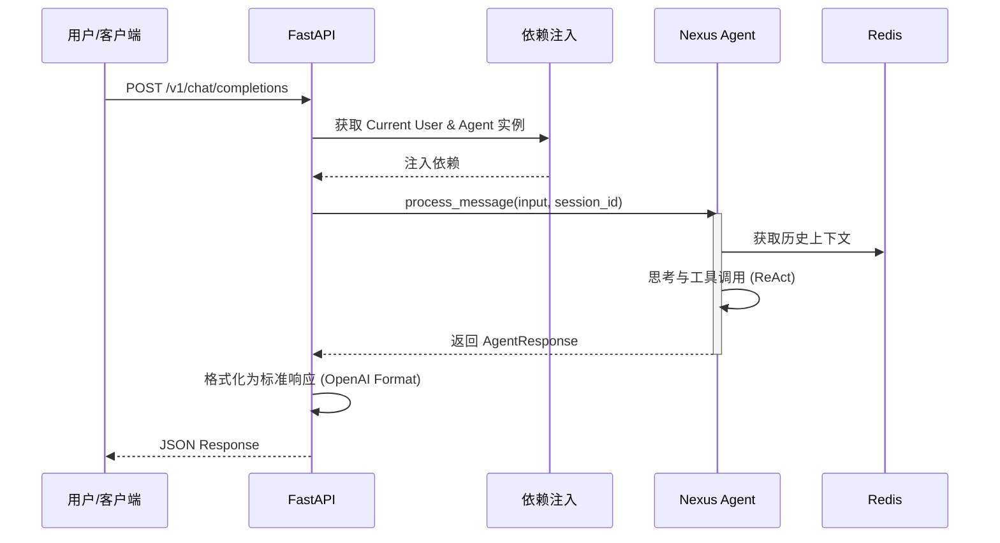

# Sprint 5: API 服务与编排 (The "Orchestrator")

## 🎯 Sprint Objective

**目标：** 将 Nexus Agent 封装为标准的 RESTful API 服务，不仅让其"能说会道"，还能"对外开放"。

构建基于 FastAPI 的后端服务，为前端界面（Web/Mobile）或企业 IM（钉钉/飞书）提供统一的接入点。在该层实现对话路由（Routing）和请求编排，确保 Agent 能够流畅地处理外部请求并维护会话状态。

**状态：** 🔄 规划中
**预计开始日期：** 2026-01-23
**预计结束日期：** 2026-02-05

---

## 📋 Sprint Overview

**Duration:** 2 周
**Focus Area:** Backend API Development & Service Composition
**Key Deliverables:**
- FastAPI 项目结构搭建
- RESTful 接口定义 (OpenAPI/Swagger)
- 聊天接口 (`/v1/chat/completions`)
- 会话管理接口 (`/v1/sessions`)
- 统一的错误处理与日志中间件
- CORS 与基础鉴权支持

---

## 🏗️ Technical Architecture

### 整体架构图

```mermaid
graph TD
    Client[客户端 (Web/IM)] -->|HTTP Request| API[FastAPI 网关]
    
    subgraph "API Layer (Sprint 5)"
        API --> Auth[鉴权 & 限流]
        Auth --> Router[路由分发]
        Router -->|/chat| ChatCtrl[聊天控制器]
        Router -->|/sessions| SessCtrl[会话控制器]
        
        ChatCtrl --> Svc[Agent 服务封装]
    end
    
    subgraph "Agent Core (Sprint 1-4)"
        Svc --> Nexus[Nexus Agent]
        Nexus --> Memory[Redis 记忆]
        Nexus --> Tools[工具集]
    end
    
    Svc --> DB[持久化存储]
```

### 请求处理流程



---

## 📝 Detailed Implementation Plan

### 1. API 基础框架搭建

#### 1.1 项目结构重构
为了支持 API 服务，需要在 `nexus_agent` 下新增 API 模块。

**目录结构：**
```text
nexus_agent/
├── api/
│   ├── __init__.py
│   ├── main.py            # 应用入口
│   ├── config.py          # API 配置
│   ├── dependencies.py    # 依赖注入
│   ├── routers/           # 路由模块
│   │   ├── chat.py
│   │   ├── health.py
│   │   └── sessions.py
│   └── schemas/           # Pydantic 模型
│       ├── chat.py
│       └── common.py
```

#### 1.2 核心入口配置

**文件：** `nexus_agent/api/main.py`

```python
from fastapi import FastAPI
from fastapi.middleware.cors import CORSMiddleware
from nexus_agent.api.routers import chat, health, sessions
from nexus_agent.config.settings import config

def create_app() -> FastAPI:
    app = FastAPI(
        title="Nexus Agent API",
        description="Enterprise Agent Service",
        version="0.5.0",
        docs_url="/docs",
        redoc_url="/redoc"
    )
    
    # 配置 CORS
    app.add_middleware(
        CORSMiddleware,
        allow_origins=["*"],  # 生产环境需配置为具体域名
        allow_credentials=True,
        allow_methods=["*"],
        allow_headers=["*"],
    )
    
    # 注册路由
    app.include_router(health.router, prefix="/v1", tags=["Health"])
    app.include_router(chat.router, prefix="/v1/chat", tags=["Chat"])
    app.include_router(sessions.router, prefix="/v1/sessions", tags=["Sessions"])
    
    return app

app = create_app()
```

### 2. 接口定义与数据模型

#### 2.1 聊天接口模型 (OpenAI 兼容风格)

**文件：** `nexus_agent/api/schemas/chat.py`

```python
from pydantic import BaseModel, Field
from typing import List, Optional, Dict, Any, Union

class Message(BaseModel):
    role: str
    content: str

class ChatCompletionRequest(BaseModel):
    messages: List[Message]
    model: Optional[str] = None
    session_id: Optional[str] = None
    stream: bool = False
    temperature: Optional[float] = None
    user: Optional[str] = None

class ChatCompletionResponseChoice(BaseModel):
    index: int
    message: Message
    finish_reason: Optional[str] = None

class ChatCompletionResponse(BaseModel):
    id: str
    object: str = "chat.completion"
    created: int
    model: str
    choices: List[ChatCompletionResponseChoice]
    usage: Optional[Dict[str, int]] = None
    # 扩展字段：用于返回工具调用详情或调试信息
    nexus_metadata: Optional[Dict[str, Any]] = None
```

### 3. 核心业务逻辑实现

#### 3.1 聊天路由实现

**文件：** `nexus_agent/api/routers/chat.py`

在此集成 `NexusLangChainAgent`，处理具体的对话请求。

```python
import uuid
import time
from fastapi import APIRouter, Depends, HTTPException
from nexus_agent.agent.agent import get_nexus_agent  # 需实现该工厂方法
from nexus_agent.api.schemas.chat import ChatCompletionRequest, ChatCompletionResponse

router = APIRouter()

@router.post("/completions", response_model=ChatCompletionResponse)
async def chat_completions(
    request: ChatCompletionRequest,
    agent = Depends(get_nexus_agent)
):
    try:
        # 获取最后一条用户消息
        user_input = request.messages[-1].content
        
        # 调用 Agent
        # 注意：这里需要适配 NexusLangChainAgent 的 process_message 接口
        response = agent.process_message(
            user_input=user_input,
            session_id=request.session_id,
            user_id=request.user
        )
        
        if not response.success:
            raise HTTPException(status_code=500, detail=response.error)

        # 构造响应
        return ChatCompletionResponse(
            id=f"chatcmpl-{uuid.uuid4()}",
            created=int(time.time()),
            model=agent.model,
            choices=[{
                "index": 0,
                "message": {
                    "role": "assistant",
                    "content": response.content
                },
                "finish_reason": "stop"
            }],
            nexus_metadata={
                "session_id": response.session_id,
                "tool_calls": response.tool_calls,
                "duration": response.duration
            }
        )
    except Exception as e:
        raise HTTPException(status_code=500, detail=str(e))
```

### 4. 环境配置与依赖管理

#### 4.1 新增依赖

需要更新 `requirements.txt` 或 `pyproject.toml`，添加以下依赖：

- `fastapi`
- `uvicorn[standard]`
- `pydantic`
- `python-multipart`

#### 4.2 启动脚本

创建 `run_server.py` 或使用 uvicorn 命令启动：

```bash
uvicorn nexus_agent.api.main:app --reload --host 0.0.0.0 --port 8000
```

---

## ✅ Verification Plan

### 1. 自动化测试
* 编写 API 集成测试 (`tests/api/test_chat_routes.py`)。
* 测试会话持久性：发送带 `session_id` 的请求，验证 Agent 是否记住之前的对话。

### 2. Swagger UI 测试
* 启动服务后访问 `http://localhost:8000/docs`。
* 使用 "Try it out" 功能发送聊天请求，验证返回格式是否符合 JSON Schema。

### 3. 真实场景模拟
* 模拟前端调用：连续发送 3 条消息，观察响应速度和上下文连贯性。
* 压力测试：并发发送 10 个请求，检查服务稳定性（可选）。
